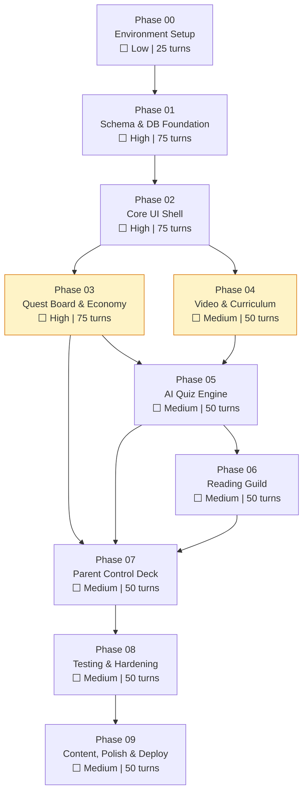

# BUILDPLAN: QuestTrack Academy

**Spec Version:** v2 (LOCKED)
**SOW Reference:** questtrack-academy-sow-v2.md
**Generated:** July 7, 2026
**Target Stack:** React + Vite + Tailwind, Supabase (PostgreSQL + Edge Functions + Realtime), Capacitor (Android TV APK), Anthropic Haiku 4.5
**Deployment Target:** Android TV APK (bundled React) + Netlify/Vercel (web)
**Operator:** Claude Code via Nimbalyst IDE (Windows)
**Orchestration Mode:** Lead Agent + Sub-Agents (Nimbalyst multi-agent)

---

## Lead Agent Orchestration Protocol

You are the **lead orchestration agent** for the QuestTrack Academy build. Your job is to execute this build plan by spawning sub-agents for each phase, monitoring their output, running review cycles, and advancing through the dependency graph.

### Your Files

| File | Purpose | You Own It |
|------|---------|------------|
| `BUILDPLAN.md` | This file. Master orchestration. | Read-only reference |
| `questtrack-spec-v2.md` | Locked specification. Source of truth. | Read-only reference |
| `questtrack-academy-sow-v2.md` | Statement of Work. Feature traceability. | Read-only reference |
| `questtrack-progress.md` | Progress tracker. You update this after every phase. | **Yes — you write this** |
| `phase-NN-*.md` | Operator prompts. One per phase. You hand these to sub-agents. | Read-only handoff |
| `review-phase-NN.md` | Review prompts. You hand these to reviewer sub-agents. | Read-only handoff |
| `PHASE-NN-PROGRESS.md` | Per-phase progress file written by the sub-agent. | Sub-agent writes, you read |

### Execution Loop

For each phase in dependency order:

```
1. CHECK PREREQUISITES
   - Read questtrack-progress.md
   - Verify all prerequisite phases show status ✅ COMPLETE
   - If any prerequisite is ❌ FAILED or ⏸️ BLOCKED, stop and report

2. SPAWN BUILDER SUB-AGENT
   - Hand the sub-agent the phase operator prompt file (e.g., phase-03-quest-board.md)
   - The sub-agent also needs access to: questtrack-spec-v2.md, the project working directory
   - The sub-agent runs autonomously through all tasks in the prompt
   - It produces a completion report and PHASE-NN-PROGRESS.md when done

3. COLLECT COMPLETION REPORT
   - Read the sub-agent's completion report
   - Read PHASE-NN-PROGRESS.md
   - Check: did all acceptance criteria PASS?
   - If the sub-agent hit turn limits without finishing, resume it with --continue

4. SPAWN REVIEWER SUB-AGENT
   - Hand the reviewer the review prompt file (e.g., review-phase-03.md)
   - Append the builder's completion report to the review prompt
   - The reviewer inspects code on disk independently and returns a JSON verdict

5. PROCESS VERDICT
   - PROMOTE → Update questtrack-progress.md to ✅, advance to next phase
   - FIX → Extract fix instructions from reviewer output, re-run builder sub-agent with fixes
   - ESCALATE → Log the escalation in questtrack-progress.md, pause the pipeline, report to human

6. UPDATE PROGRESS
   - Write current status to questtrack-progress.md
   - Log: phase name, verdict, timestamp, any issues found
   - If parallel phases are available, spawn both simultaneously (see §Parallel Execution)
```

### Parallel Execution

When the dependency graph allows it, spawn multiple builder sub-agents simultaneously:

**Phase 03 (Quest Board & Economy) and Phase 04 (Video & Curriculum)** can run in parallel — they share no files beyond the Core UI Shell from Phase 02.

To execute in parallel:
1. Verify Phase 02 is ✅ COMPLETE
2. Spawn sub-agent A with `phase-03-quest-board.md`
3. Spawn sub-agent B with `phase-04-video-curriculum.md`
4. Wait for both to complete
5. Review both (can also review in parallel)
6. Both must be ✅ before Phase 05 can start

### Error Recovery

| Situation | Action |
|-----------|--------|
| Sub-agent hits turn limit | Resume with `--continue`. The PHASE-NN-PROGRESS.md file carries state. |
| Sub-agent reports BLOCKED items | Check if the blocker is from a previous phase. If yes, go back and fix that phase first. If the blocker is a spec ambiguity, log as ESCALATE. |
| Reviewer returns FIX (1-2 issues) | Spawn a new builder sub-agent with the fix instructions. Don't re-run the whole phase. |
| Reviewer returns FIX (5+ issues) | Re-run the full phase prompt. The sub-agent will check PHASE-NN-PROGRESS.md and skip completed tasks. |
| Reviewer returns ESCALATE | Stop the pipeline. Write the escalation details to questtrack-progress.md. Wait for human input. |
| Build fails (npm error, migration error) | Check the error. If it's a dependency issue, verify Phase 00 completed correctly. If it's a code bug, include the error in a fix prompt to the builder sub-agent. |

### Human Checkpoints

Pause and wait for human confirmation at these gates:

1. **After Phase 01 (Schema)** — Schema errors cascade into everything. Human should verify tables, RPCs, and RLS policies before proceeding.
2. **After Phase 02 (Core UI)** — Human should verify the app boots, spatial nav works, profiles switch. This is the TV experience foundation.
3. **After Phase 07 (Parent Control)** — All features complete. Human should do a manual walkthrough before testing phase.
4. **Any ESCALATE verdict** — Human makes the architectural call.

Between these gates, run autonomously.

### Sub-Agent Prompt Template

When spawning a sub-agent, provide:

```
Read the operator prompt file: [phase-NN-name.md]
Read the spec file: questtrack-spec-v2.md
Working directory: [project root]
Execute all tasks in the operator prompt.
When complete, write your completion report to PHASE-NN-COMPLETION.md in the project root.
```

---

## Build Sequence



*Yellow phases (03 & 04) can run in parallel.*

---

## Phase Summary

| Phase | Name | Complexity | `--max-turns` | Prerequisites | SOW Features | Operator File | Review File | Status |
|-------|------|-----------|---------------|---------------|-------------|---------------|-------------|--------|
| 00 | Environment Setup | Low | 25 | None | — | `phase-00-environment.md` | `review-phase-00.md` | ⬜ |
| 01 | Schema & DB Foundation | High | 75 | Phase 00 | — | `phase-01-schema.md` | `review-phase-01.md` | ⬜ |
| 02 | Core UI Shell | High | 75 | Phase 01 | F-001–F-003, F-020–F-024 | `phase-02-core-ui.md` | `review-phase-02.md` | ⬜ |
| 03 | Quest Board & Economy | High | 75 | Phase 02 | F-012–F-016, F-019 | `phase-03-quest-board.md` | `review-phase-03.md` | ⬜ |
| 04 | Video & Curriculum | Medium | 50 | Phase 02 | F-004–F-008 | `phase-04-video-curriculum.md` | `review-phase-04.md` | ⬜ |
| 05 | AI Quiz Engine | Medium | 50 | Phase 03 + 04 | F-009, F-016 (logic) | `phase-05-quiz-engine.md` | `review-phase-05.md` | ⬜ |
| 06 | Reading Guild | Medium | 50 | Phase 05 | F-010, F-011 | `phase-06-reading-guild.md` | `review-phase-06.md` | ⬜ |
| 07 | Parent Control Deck | Medium | 50 | Phase 03, 05, 06 | F-017, F-018 | `phase-07-parent-control.md` | `review-phase-07.md` | ⬜ |
| 08 | Testing & Hardening | Medium | 50 | Phase 07 | — | `phase-08-testing.md` | `review-phase-08.md` | ⬜ |
| 09 | Content, Polish & Deploy | Medium | 50 | Phase 08 | — | `phase-09-deploy.md` | `review-phase-09.md` | ⬜ |

---

## Feature Traceability

Every SOW feature mapped to exactly one build phase.

| SOW Feature | Description | Build Phase | Spec Sections | Status |
|-------------|-------------|-------------|---------------|--------|
| F-001 | Smart TV Spatial Navigation Engine | Phase 02 | §5.3, §5.1 | ⬜ |
| F-002 | Kid Profile Switcher with Soft-Lock | Phase 02 | §3.2, §5.1 | ⬜ |
| F-003 | Hero Stats HUD | Phase 02 | §5.1, §6.1 | ⬜ |
| F-004 | NYS Mathematics Curriculum | Phase 04 | §2.1 (modules, lessons) | ⬜ |
| F-005 | NYS ELA Reading Curriculum | Phase 04 | §2.1 (modules, lessons) | ⬜ |
| F-006 | NYS Science Curriculum | Phase 04 | §2.1 (modules, lessons) | ⬜ |
| F-007 | Social Studies & History Curriculum | Phase 04 | §2.1 (modules, lessons) | ⬜ |
| F-008 | Video Lesson Player with Anti-Escape | Phase 04 | §6.3, §5.1 | ⬜ |
| F-009 | AI Quiz Engine with Timeout Fallback | Phase 05 | §4.2, §2.4, §6.2 | ⬜ |
| F-010 | Reading Guild — Book Library & Tracking | Phase 06 | §2.1 (books, book_progress), §5.1 | ⬜ |
| F-011 | Reading Guild — AI Chapter Checkpoints | Phase 06 | §4.2 (generate-checkpoint), §5.1 | ⬜ |
| F-012 | Quest Board — Daily Tasks | Phase 03 | §2.4 (complete_chore), §5.1 | ⬜ |
| F-013 | Quest Board — Weekly Raids | Phase 03 | §2.4 (complete_chore), §5.1 | ⬜ |
| F-013b | Quest Board — Monthly Epics | Phase 03 | §2.4 (complete_chore), §5.1 | ⬜ |
| F-013c | Progressive Quest Ramp | Phase 03 | §2.5 (weekly_completion_rate), §5.1 | ⬜ |
| F-014 | Automatic Chore Reset with Approval Queue | Phase 03 | §2.4 (perform_daily_reset), §4.2 | ⬜ |
| F-015 | Reward Shop with Purchase Protection | Phase 03 | §2.4 (redeem_reward), §5.1 | ⬜ |
| F-016 | Cora's Early Bird Sunrise Booster | Phase 03 (banner) + Phase 05 (logic) | §2.4 (submit_quiz), §5.1 | ⬜ |
| F-017 | Parent View — PIN Protected Admin | Phase 07 | §3.3, §4.2 (verify-pin) | ⬜ |
| F-018 | Parent View — Analytics Dashboard | Phase 07 | §2.5, §5.1 | ⬜ |
| F-019 | Family Calendar with Recurring Events | Phase 03 | §2.7, §5.1, §6.3 | ⬜ |
| F-020 | Toast Notification System | Phase 02 | §5.1, §7.1 | ⬜ |
| F-021 | Level-Up Celebration Modal | Phase 02 | §5.1 | ⬜ |
| F-022 | Canvas-Based Confetti Particle System | Phase 02 | §5.1 | ⬜ |
| F-023 | Supabase Real-Time Persistence with Offline | Phase 02 | §5.2, §6.1 | ⬜ |
| F-024 | Multi-Device Sync | Phase 02 | §5.2, §6.1 | ⬜ |

All 24 core SOW features accounted for. Enhancement features F-050–F-058 are explicitly deferred (SOW §3.2).

---

## Phase Details

### Phase 00: Environment Setup
**Complexity:** Low | **Est. Turns:** 10-15 | **`--max-turns`:** 25 | **Prerequisites:** None
**Operator Prompt:** `phase-00-environment.md`
**Review Prompt:** `review-phase-00.md`

**Objective:** Project scaffolding compiles and runs. Supabase CLI connected. Capacitor Android shell exists. All dependencies installed.

**Components Built:**
- [ ] Vite + React + Tailwind project scaffold
- [ ] Directory structure matching spec §5.1
- [ ] Package dependencies: @supabase/supabase-js, canvas-confetti, rrule, lucide-react, bcryptjs (for client-side soft-lock hashing)
- [ ] `.env` with Supabase project URL + anon key placeholders
- [ ] Supabase CLI project init + linked to remote
- [ ] Capacitor Android project shell (no logic — just the native wrapper)
- [ ] Tailwind config with dark theme tokens (deep slate background, Rose-500, Fredoka, Quicksand)
- [ ] Google Fonts loaded (Fredoka, Quicksand)
- [ ] Base `main.jsx` + `App.jsx` rendering a placeholder

**Acceptance Criteria:**
- [ ] `npm run dev` starts Vite dev server without errors
- [ ] `npm run build` produces production bundle
- [ ] Supabase CLI `supabase status` shows connected project
- [ ] Directory structure matches spec §5.1 component tree
- [ ] Tailwind utility classes render (dark background, correct fonts)

**Rollback:** Delete project directory, re-scaffold.

---

### Phase 01: Schema & DB Foundation
**Complexity:** High | **Est. Turns:** 30-40 | **`--max-turns`:** 75 | **Prerequisites:** Phase 00
**Operator Prompt:** `phase-01-schema.md`
**Review Prompt:** `review-phase-01.md`

**⚠️ HUMAN CHECKPOINT — Review schema before proceeding to Phase 02.**

**Objective:** Complete database layer. All tables, indexes, constraints, RPCs, RLS policies, views, and seed data deployed to Supabase. Every subsequent phase reads from and writes to this schema.

**Components Built:**
- [ ] 17 tables (spec §2.1 ER diagram — including processed_mutations)
- [ ] 9 indexes (spec §2.2)
- [ ] All CHECK constraints (spec §2.3)
- [ ] UNIQUE constraint on book_progress(kid_id, book_id)
- [ ] Partial unique index ux_chore_events_active
- [ ] 4 RPC functions: complete_chore, submit_quiz, redeem_reward, perform_daily_reset (spec §2.4)
- [ ] families_safe view (spec §3.2)
- [ ] kid_analytics view (spec §2.5)
- [ ] weekly_completion_rate view (spec §2.5)
- [ ] RLS policies on all tables (spec §3.2)
- [ ] Full seed data (spec §2.8)
- [ ] pg_cron job definition for quiz JSONB slimming (spec §2.6)

**Acceptance Criteria:**
- [ ] All 17 tables exist with correct columns and types
- [ ] `SELECT * FROM families_safe` excludes pin_hash, pin_attempts, pin_locked_until
- [ ] `SELECT complete_chore(...)` with valid input returns success JSON
- [ ] `SELECT complete_chore(...)` with duplicate mutation_id returns 'already_processed'
- [ ] `SELECT redeem_reward(...)` with insufficient coins returns 'insufficient_coins'
- [ ] `CHECK (coins >= 0)` prevents negative balance (test via direct UPDATE)
- [ ] ux_chore_events_active rejects duplicate active chore for same kid/chore/day
- [ ] Seed data loads: 2 kids, 17 modules, 73 lessons, 20 books, 30 chore suggestions, fallback questions
- [ ] RLS policies allow anon SELECT on all tables
- [ ] RLS policies prevent anon INSERT/UPDATE/DELETE on economy tables (chore_events, kids coins/xp, reward_redemptions)

**Rollback:** `supabase db reset` drops all and re-migrates.

---

### Phase 02: Core UI Shell
**Complexity:** High | **Est. Turns:** 35-45 | **`--max-turns`:** 75 | **Prerequisites:** Phase 01
**Operator Prompt:** `phase-02-core-ui.md`
**Review Prompt:** `review-phase-02.md`

**⚠️ HUMAN CHECKPOINT — Verify app boots on TV emulator, spatial nav works, profiles switch.**

**Objective:** App boots, connects to Supabase, displays live data, is fully navigable via D-pad remote. Offline cache works. Profiles switch with soft-lock. Level-up and confetti fire. This is the "app feels real" milestone.

**SOW Features:** F-001, F-002, F-003, F-020, F-021, F-022, F-023, F-024

**Components Built:**
- [ ] useSpatialNav hook (geometric routing, per-profile focus memory) — spec §5.3
- [ ] useSupabase hook (real-time subscriptions, state mirror) — spec §5.2
- [ ] useVisibilityReconnect hook (TV wake handler) — spec §6.1
- [ ] useDeviceType hook (TV vs mobile detection) — spec §5.1
- [ ] useConnectionHealth hook (online/offline/stale indicators) — spec §7.1
- [ ] offlineCache.js (IndexedDB + mutation queue with mutation_ids) — spec §5.2
- [ ] supabaseClient.js (init + anon key from env) — spec §5.1
- [ ] constants.js (XP cap 200, economy config) — spec §5.1
- [ ] ProfileSwitcher + SoftLockModal + SoftLockSetup — spec §3.2, §5.1
- [ ] HeroStatsHUD + ConnectionIndicator — spec §5.1
- [ ] Toast notification system — spec §7.1
- [ ] LevelUpModal with event queue — spec §5.1
- [ ] ConfettiCanvas wrapper — spec §5.1
- [ ] Header layout — spec §5.1
- [ ] Empty state components (EmptyQuestBoard, EmptyBookLibrary, EmptyCalendar, EmptyApprovalQueue) — spec §5.1
- [ ] FirstVisitHints — spec §5.1

**Acceptance Criteria:**
- [ ] Arrow keys navigate all .tv-focusable elements
- [ ] Enter activates focused element
- [ ] Profile switch requires correct soft-lock sequence
- [ ] Wrong soft-lock sequence rejected with visual feedback
- [ ] Soft-lock setup flow works for new kid (parent-assisted)
- [ ] HeroStatsHUD shows live data from Supabase (level, xp, coins, streak)
- [ ] Change kid's coins via Supabase SQL → HeroStatsHUD updates within 2s
- [ ] Toast displays and auto-dismisses after ~4s
- [ ] Level-up modal fires when XP crosses 100 threshold
- [ ] Confetti fires at element coordinates
- [ ] Disconnect WiFi → "Saving locally" indicator appears
- [ ] Reconnect → queued mutations replay
- [ ] Empty states render when data tables are empty
- [ ] App runs on Android TV emulator via Capacitor (if toolchain available)

**Rollback:** Git revert to Phase 01 tag. No persistent state beyond DB (which is unchanged).

---

### Phase 03: Quest Board & Economy
**Complexity:** High | **Est. Turns:** 40-50 | **`--max-turns`:** 75 | **Prerequisites:** Phase 02
**Operator Prompt:** `phase-03-quest-board.md`
**Review Prompt:** `review-phase-03.md`
**⚡ PARALLELIZABLE with Phase 04**

**Objective:** Kids check off chores and earn coins/XP. Parents see approval queue. Rewards purchasable. Calendar shows events. Chores reset automatically at midnight ET. Progressive ramp suggests new chores. This is the daily-use backbone.

**SOW Features:** F-012, F-013, F-013b, F-013c, F-014, F-015, F-016 (banner only), F-019

**Components Built:**
- [ ] QuestBoard + ChoreCard (daily/weekly/monthly sections, debounce, confetti) — spec §5.1
- [ ] useEconomy hook (complete_chore RPC calls) — spec §5.1
- [ ] useCatchUpReset hook (perform_daily_reset on mount/visibilitychange) — spec §5.1
- [ ] daily-reset Edge Function (hourly cron, AT TIME ZONE check, email notification) — spec §4.2
- [ ] RewardGrid + PurchaseConfirm + PurchaseProgressIndicator — spec §5.1
- [ ] CalendarView (TV=agenda, mobile=month) + EventCard + SomedayBucket — spec §5.1
- [ ] rruleParser.js (bounded expansion, memoized, pinned version) — spec §2.7
- [ ] clockService.js (UTC utilities) — spec §5.1
- [ ] EarlyBirdBanner (display only — logic in Phase 05) — spec §5.1
- [ ] ProgressiveRamp (admin/, weekly_completion_rate query, suggestions) — spec §5.1
- [ ] ChoreBuilder + RewardBuilder (mobile-only, minimal CRUD) — spec §5.1
- [ ] Parent-write Edge Functions: create-chore, update-chore, delete-chore, create-reward, update-reward, delete-reward, approve-chore, reject-chore, create-calendar-event, update-calendar-event, delete-calendar-event — spec §4.2

**Acceptance Criteria:**
- [ ] Checking a daily chore: confetti fires, coins/XP increase via complete_chore RPC
- [ ] Checking same chore again: 'already_processed' (debounce + idempotency)
- [ ] Daily XP cap: after 200 XP earned, next chore awards 0 XP (coins still awarded)
- [ ] Midnight ET: cron transitions completed → pending_approval (test via manual RPC call)
- [ ] Multi-day catch-up: set last_daily_reset to 3 days ago → catch-up processes all missed days
- [ ] Auto-approve: pending_approval items older than auto_approve_hours transition to approved
- [ ] Reject chore: coins clawed back, toast appears on kid's next login
- [ ] Reward purchase: hold Enter 2s → progress indicator fills → coins deducted → toast confirms
- [ ] Reward with insufficient coins: 'insufficient_coins' error, no deduction
- [ ] Calendar recurring event: weekly event renders on correct days within bounded window
- [ ] Progressive ramp: kid at ≥80% weekly completion → parent admin shows "Ready to Grow"
- [ ] ChoreBuilder: parent adds/edits/deletes chore on mobile (not visible on TV-width viewport)
- [ ] Calendar events color-coded: Quinn=amber, Cora=purple, Family=emerald

**Rollback:** Git revert to Phase 02 tag. Drop Phase 03 Edge Functions.

---

### Phase 04: Video & Curriculum
**Complexity:** Medium | **Est. Turns:** 20-30 | **`--max-turns`:** 50 | **Prerequisites:** Phase 02
**Operator Prompt:** `phase-04-video-curriculum.md`
**Review Prompt:** `review-phase-04.md`
**⚡ PARALLELIZABLE with Phase 03**

**Objective:** Kids browse curriculum modules, watch embedded YouTube lessons, and can't escape to unrelated content. 85% watch time gates quiz access.

**SOW Features:** F-004, F-005, F-006, F-007, F-008

**Components Built:**
- [ ] ModuleGrid (4 subjects × 4-5 modules) — spec §5.1
- [ ] LessonPlayer (YouTube IFrame + overlay + restrictive params + fallback video) — spec §6.3
- [ ] 85% watch time gate (progress polling, quiz unlock) — spec §6.3
- [ ] Self-hosted MP4 fallback player — spec §6.3
- [ ] Capacitor config: setMediaPlaybackRequiresUserGesture(false) — spec §6.4

**Acceptance Criteria:**
- [ ] Module grid renders 17 modules across 4 subject categories
- [ ] Selecting a lesson embeds YouTube video with overlay blocking IFrame focus
- [ ] D-pad cannot interact with YouTube UI (arrows stay in app, not YouTube player)
- [ ] YouTube params: controls=0, rel=0, modestbranding=1, disablekb=1, fs=0
- [ ] Watch progress bar fills; quiz unlock appears at ≥85%
- [ ] Scrubbing to end does not bypass 85% gate (polling validates cumulative time)
- [ ] If YouTube fails within 10s: "Video unavailable" + skip-to-quiz option
- [ ] Fallback video ID loads when primary unavailable

**Rollback:** Git revert to Phase 02 tag. No DB changes in this phase.

---

### Phase 05: AI Quiz Engine
**Complexity:** Medium | **Est. Turns:** 25-35 | **`--max-turns`:** 50 | **Prerequisites:** Phase 03 + 04
**Operator Prompt:** `phase-05-quiz-engine.md`
**Review Prompt:** `review-phase-05.md`

**Objective:** After watching a video, kids take AI-generated quizzes. Questions are fresh per session, fallback seamlessly on timeout, award XP/coins via atomic submit_quiz RPC, and respect Early Bird and daily XP cap.

**SOW Features:** F-009, F-016 (logic)

**Components Built:**
- [ ] generate-quiz Edge Function (Anthropic proxy, 4s timeout, tier-1/tier-2 fallback) — spec §4.2
- [ ] QuizEngine + QuizQuestion + LoadingQuiz (cancel/back button) — spec §5.1
- [ ] In-flight ref guard + mutation_id dedup — spec §6.2
- [ ] Client AbortController at 6-7s — spec §6.2
- [ ] AI system prompt (growth-mindset, 3rd grade, prohibited language) — spec §4.2
- [ ] submit_quiz RPC integration (Early Bird server-side, daily XP cap, idempotency) — spec §2.4
- [ ] Retry cap: 2 per question → reveal + 50% partial XP — spec §4.2
- [ ] EarlyBirdBanner logic activation (wired to submit_quiz response) — spec §5.1

**Acceptance Criteria:**
- [ ] Quiz generates 3-5 unique MC questions per session
- [ ] Questions reference correct NYS standard codes for the lesson's module
- [ ] 4s Anthropic timeout → seamless fallback to fallback_questions table
- [ ] Supabase fallback unreachable → client JSON bank loads (tier-2)
- [ ] Wrong answer: encouraging explanation (never "wrong", "incorrect", "failed")
- [ ] After 2 failures on one question: reveal correct answer + 50% partial XP
- [ ] Quiz at 6:30 AM ET: Early Bird doubles XP, adds +20 coins (server-validated)
- [ ] Quiz at 10:00 AM ET: base rewards only (no Early Bird)
- [ ] Offline quiz: base rewards, no Early Bird multiplier
- [ ] Daily XP cap: 200 XP ceiling across chores + quizzes combined
- [ ] Duplicate quiz submission (same mutation_id): 'already_processed'
- [ ] Cancel button on "Summoning Quiz..." loading screen returns to lesson

**Rollback:** Git revert to Phase 04 tag. Drop generate-quiz Edge Function.

---

### Phase 06: Reading Guild
**Complexity:** Medium | **Est. Turns:** 25-30 | **`--max-turns`:** 50 | **Prerequisites:** Phase 05
**Operator Prompt:** `phase-06-reading-guild.md`
**Review Prompt:** `review-phase-06.md`

**Objective:** Kids browse assigned books, log chapter progress, take AI-generated comprehension checkpoints, and earn XP/coins for reading. Parents assign books and see reading progress.

**SOW Features:** F-010, F-011

**Components Built:**
- [ ] BookLibrary (3 tiers, "Currently Reading" shelf) — spec §5.1
- [ ] BookDetail (progress, "I finished Chapter X" button) — spec §5.1
- [ ] ChapterCheckpoint (MC-only on TV, open-response on mobile) — spec §5.1
- [ ] BookReflection (star rating + reflection_text, mobile/web only) — spec §5.1
- [ ] generate-checkpoint Edge Function (chapter summaries in prompt) — spec §4.2
- [ ] BookAssigner (parent mobile/web, auto-suggest next) — spec §5.1
- [ ] Parent-write Edge Function: assign-book — spec §4.2
- [ ] Reading badges + streak tracking — spec §5.1
- [ ] TV toast on new book assignment — spec §7.1

**Acceptance Criteria:**
- [ ] Book library renders 20 books across 3 tiers
- [ ] "Currently Reading" shelf shows assigned-in-progress books prominently
- [ ] "I finished Chapter X" → checkpoint quiz generates using chapter summary
- [ ] Checkpoint questions on TV: MC-only (no text input)
- [ ] Checkpoint questions on mobile: MC (open-response deferred to v1.5)
- [ ] Book completion: badge awarded, XP/coins via submit_quiz pattern
- [ ] Reading streak increments on consecutive daily chapter logs
- [ ] Duplicate book assignment prevented (unique constraint error handled gracefully)
- [ ] Parent assigns book on mobile → TV shows toast notification
- [ ] Auto-suggest: on book completion, BookAssigner recommends next unread book from same/adjacent tier

**Rollback:** Git revert to Phase 05 tag. Drop generate-checkpoint Edge Function.

---

### Phase 07: Parent Control Deck
**Complexity:** Medium | **Est. Turns:** 25-35 | **`--max-turns`:** 50 | **Prerequisites:** Phase 03, 05, 06
**Operator Prompt:** `phase-07-parent-control.md`
**Review Prompt:** `review-phase-07.md`

**⚠️ HUMAN CHECKPOINT — All features complete. Manual walkthrough before testing.**

**Objective:** Parents access a PIN-protected admin with analytics, approval queue, and full CRUD. TV is read-only admin. Mobile/web is full CRUD. Session tokens gate all parent-write Edge Functions.

**SOW Features:** F-017, F-018

**Components Built:**
- [ ] ParentPinPad (custom numpad, D-pad navigable on TV) — spec §5.1
- [ ] verify-pin Edge Function (bcrypt, rate limiting, session token generation) — spec §4.2
- [ ] Session token validation middleware on all parent-write Edge Functions — spec §3.3
- [ ] AdminDashboard (kid_analytics view, weekly_completion_rate view) — spec §5.1
- [ ] ApprovalQueue (approve/reject, claw-back toast on rejection) — spec §5.1
- [ ] Device-aware admin: TV = read-only metrics + toggles; Mobile = full CRUD — spec §5.1
- [ ] EventBuilder (calendar CRUD, mobile-only) — spec §5.1
- [ ] BookAssigner integration with PIN gate — spec §5.1
- [ ] Emergency controls: force morning boost, uncheck all, factory reset — spec §5.1
- [ ] StaleResetBanner (>26h since last_daily_reset) — spec §5.1
- [ ] Auto-approve hours setting (configurable) — spec §2.4
- [ ] Parent-write Edge Function: update-family-settings, reset-soft-lock — spec §4.2

**Acceptance Criteria:**
- [ ] PIN entry via D-pad numpad on TV works (1-2-3-4 unlocks with seed data)
- [ ] 5 wrong PINs → 5-minute lockout with countdown
- [ ] Session token expires after 30 min inactivity
- [ ] All parent-write Edge Functions reject requests without valid session token
- [ ] Analytics dashboard shows correct per-kid metrics from views
- [ ] Approval queue: approve locks coins in, reject claws back with toast
- [ ] TV viewport: no text-entry fields visible (ChoreBuilder, EventBuilder hidden)
- [ ] Mobile viewport: full CRUD visible and functional
- [ ] Emergency: force morning boost toggle works, factory reset requires confirmation
- [ ] StaleResetBanner appears when last_daily_reset > 26h ago

**Rollback:** Git revert to Phase 06 tag. Drop verify-pin + parent-write Edge Functions' token checks (revert to interim trust model).

---

### Phase 08: Testing & Hardening
**Complexity:** Medium | **Est. Turns:** 25-35 | **`--max-turns`:** 50 | **Prerequisites:** Phase 07
**Operator Prompt:** `phase-08-testing.md`
**Review Prompt:** `review-phase-08.md`

**Objective:** Automated test coverage for critical paths. Security audit. Observability checks. Confidence that the app works end-to-end.

**Components Built:**
- [ ] Vitest config + unit tests for: hooks, RPCs, economy math, rrule bounds, clock service
- [ ] Playwright config + E2E tests for critical journeys (spec §8.2)
- [ ] Security audit: no leaked API keys, no direct DB writes bypassing RPCs, session token expiry
- [ ] Toast copy audit: all error messages match spec §7.1 taxonomy
- [ ] Connection indicator state audit: online/offline/syncing transitions

**Acceptance Criteria:**
- [ ] `npm run test` passes all unit tests
- [ ] Playwright E2E: kid-completes-chore journey passes
- [ ] Playwright E2E: watch-video-take-quiz journey passes
- [ ] Playwright E2E: parent-approval-flow journey passes
- [ ] Playwright E2E: multi-device-sync journey passes (two browser contexts)
- [ ] No Supabase service_role key or Anthropic API key in client bundle
- [ ] No direct INSERT/UPDATE on kids.coins or kids.xp outside of RPCs
- [ ] All toasts match spec §7.1 error taxonomy

**Rollback:** Tests don't affect production code. Remove test files if needed.

---

### Phase 09: Content, Polish & Deploy
**Complexity:** Medium | **Est. Turns:** 20-30 | **`--max-turns`:** 50 | **Prerequisites:** Phase 08
**Operator Prompt:** `phase-09-deploy.md`
**Review Prompt:** `review-phase-09.md`

**Objective:** Production-ready content loaded, APK built and sideloaded, UI polished, backup and retention procedures documented.

**Components Built:**
- [ ] YouTube video IDs + fallback_video_ids populated in lessons table
- [ ] Fallback quiz bank generated (50 questions/subject) and seeded
- [ ] Chapter summaries for all 20 books seeded
- [ ] Chore suggestion bank JSON verified and seeded
- [ ] UI polish: transitions, animations, responsive breakpoints, TV 10-foot typography
- [ ] Capacitor APK build (bundled React assets, no Service Workers)
- [ ] app_version table populated with v1.0.0
- [ ] Sideload test on Android TV / Fire Stick
- [ ] Data retention policy documented (spec §2.6)
- [ ] Supabase backup procedure documented (pg_dump + free tier daily backups)
- [ ] pg_cron job deployed for quiz JSONB slimming
- [ ] Netlify/Vercel deployment for web app

**Acceptance Criteria:**
- [ ] All 17 modules have at least 1 functioning video + quiz flow
- [ ] APK boots offline from bundled assets
- [ ] APK connects to Supabase on WiFi, real-time sync works
- [ ] Full family workflow tested: TV + phone simultaneously
- [ ] Parent receives email notification from daily-reset cron
- [ ] pg_cron job slims quiz_attempts JSONB older than 30 days (test with backdated row)
- [ ] Backup procedure documented and tested (pg_dump export + restore)
- [ ] Web app accessible at configured URL

**Rollback:** APK re-build from clean Phase 08 state. Content is additive (seed data), not destructive.

---

## Risk Register

| Risk | Phase Affected | Mitigation |
|------|---------------|------------|
| Schema errors cascade into all downstream phases | Phase 01 | Human checkpoint after Phase 01. Heavy review. |
| YouTube IFrame focus capture breaks spatial nav | Phase 04 | Transparent overlay div tested on TV emulator. Fallback: skip-to-quiz. |
| Anthropic API latency > 4s consistently | Phase 05 | Fallback bank seamless. Monitor in Phase 09 polish. |
| Capacitor WebView missing WebSocket support | Phase 09 | Test on target hardware. Periodic poll fallback exists in useVisibilityReconnect. |
| Daily XP cap + Early Bird interaction edge cases | Phase 05 | Unit tests for cap math. E2E test in Phase 08. |
| PIN session token timing issues | Phase 07 | 30-min expiry is generous. Test expiry in Phase 08 E2E. |
| rrule.js unbounded expansion freezes TV | Phase 03 | Bounded to [view_start, view_end]. Memoized. Unit tested. |
| Offline mutation replay creates duplicates | Phase 02, 03 | processed_mutations table + mutation_id on all RPCs. Tested in Phase 01 schema. |

---

## Rollback Strategy

| Phase | Rollback Approach | Data Impact |
|-------|------------------|-------------|
| 00 | Delete project directory, re-scaffold | None |
| 01 | `supabase db reset` | Seed data only |
| 02-07 | Git revert to previous phase tag | No DB schema changes after Phase 01 |
| 08 | Remove test files | No production impact |
| 09 | Re-build APK from Phase 08 state | Content is additive |

---

## Execution Guidance

### Session Strategy Per Phase

| Phase | `--max-turns` | Expected Sessions | Notes |
|-------|---------------|-------------------|-------|
| 00 | 25 | 1 | Quick scaffold |
| 01 | 75 | 1-2 | Large migration + RPCs. May need --continue. |
| 02 | 75 | 2 | Many components. Plan for 1 --continue. |
| 03 | 75 | 2 | Complex: cron + economy + calendar + CRUD. Plan for 1-2 --continue. |
| 04 | 50 | 1 | YouTube embed is tricky but scope is focused. |
| 05 | 50 | 1-2 | Edge Function + quiz UI + fallback logic. |
| 06 | 50 | 1 | Follows Phase 05 patterns closely. |
| 07 | 50 | 1-2 | PIN + session tokens + device-aware admin. |
| 08 | 50 | 1-2 | Test writing is verbose. |
| 09 | 50 | 1-2 | Content seeding + APK build. |

### Git Tagging

After each phase is PROMOTED, the lead agent (or human) should tag:
```
git tag phase-00-complete
git tag phase-01-complete
...
```

This enables clean rollback to any phase boundary.
