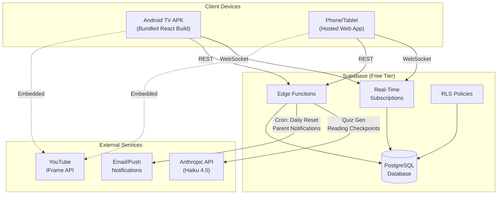
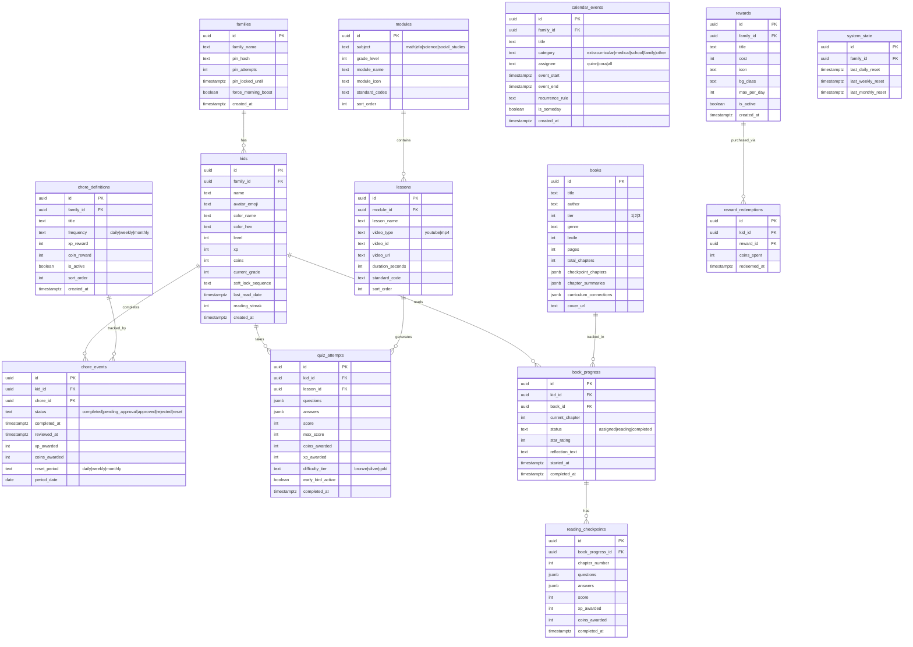

# Master Architecture Specification: QuestTrack Academy
**Version:** 1
**SOW Reference:** questtrack-academy-sow.md (v2.0)
**Date:** July 6, 2026
**Status:** DRAFT

---

## 1. System Architecture Overview

### 1.1 Architecture Diagram



### 1.2 Technology Stack

| Layer | Technology | Version | Rationale |
|-------|-----------|---------|-----------|
| Frontend | React + Vite | React 18+, Vite 5+ | Component tree architecture (REV-024). Static build output for APK bundling |
| Styling | Tailwind CSS | 3.4+ | Utility-first, TV-scale typography, dark theme tokens |
| Icons | Lucide React | Latest | Tree-shakeable, consistent style |
| Fonts | Google Fonts CDN | — | Fredoka (headings), Quicksand (body) |
| Database | Supabase PostgreSQL | Free tier | Normalized relational schema, real-time subscriptions, RLS, Edge Functions |
| Real-Time | Supabase Realtime | — | WebSocket push for multi-device sync (F-024) |
| Serverless | Supabase Edge Functions | Deno | API proxy for Anthropic (REV-002), cron for resets/notifications (REV-017) |
| AI | Anthropic API (Haiku 4.5) | — | Quiz generation, reading checkpoints. Proxied via Edge Functions |
| Video | YouTube IFrame API | v3 | Embedded lessons with overlay control (REV-004) |
| Particles | canvas-confetti | 1.9+ | Hardware-accelerated celebration effects (REV-020) |
| TV Build | Capacitor | 5+ | Bundles React build into APK assets (REV-013) |
| Web Hosting | Netlify or Vercel | — | Phone/tablet access via hosted URL |

### 1.3 Deployment Topology

**TV (Android TV / Fire TV):**
- React build bundled inside Capacitor APK `/android/app/src/main/assets/` (REV-013)
- APK loads app locally — no network needed for shell boot
- Supabase syncs when online; local cache when offline
- Updates: service worker checks for new assets on launch; major updates require APK re-sideload

**Phone/Tablet (Web):**
- Hosted on Netlify/Vercel at `https://questtrack.yourdomain.com`
- Same React build, standard browser access
- Auto-updates on deploy
- Parent CRUD (text entry) happens here (REV-014)

---

## 2. Database Schema

### 2.1 Entity Relationship Diagram



### 2.2 Key Schema Decisions (from Review Findings)

**REV-001 — Normalized schema:** No monolithic state blob. Each entity is its own table. Coin/XP mutations use Supabase RPC:

```sql
-- Supabase RPC function for atomic coin/xp updates
CREATE OR REPLACE FUNCTION award_currency(
    p_kid_id uuid, p_coins int, p_xp int
) RETURNS json AS $$
DECLARE
    v_kid kids%ROWTYPE;
    v_leveled_up boolean := false;
    v_new_level int;
BEGIN
    UPDATE kids SET
        coins = coins + p_coins,
        xp = xp + p_xp
    WHERE id = p_kid_id
    RETURNING * INTO v_kid;

    -- Level-up check
    IF v_kid.xp >= 100 THEN
        UPDATE kids SET
            level = level + (xp / 100),
            xp = xp % 100
        WHERE id = p_kid_id
        RETURNING level INTO v_new_level;
        v_leveled_up := true;
    END IF;

    RETURN json_build_object(
        'coins', v_kid.coins + p_coins,
        'xp', v_kid.xp,
        'level', COALESCE(v_new_level, v_kid.level),
        'leveled_up', v_leveled_up
    );
END;
$$ LANGUAGE plpgsql SECURITY DEFINER;
```

**REV-003 — Chore status transitions:**

```
State Machine: NEW → completed → pending_approval → approved/rejected → reset
                                                         ↑
                                     (midnight catch-up runs on app mount)
```

**REV-006 — PIN security:**

```sql
-- family_settings stores bcrypt hash
ALTER TABLE families ADD COLUMN pin_attempts int DEFAULT 0;
ALTER TABLE families ADD COLUMN pin_locked_until timestamptz;

-- RLS: all tables scoped to family_id
ALTER TABLE kids ENABLE ROW LEVEL SECURITY;
CREATE POLICY "family_access" ON kids
    USING (family_id = (SELECT family_id FROM auth_context()));
-- Repeated for all tables
```

**REV-019 — Recurring events:** Stored as iCal RRULE strings:

```sql
-- Example: Soccer every Tuesday at 4:30 PM
INSERT INTO calendar_events (title, event_start, recurrence_rule, assignee)
VALUES ('⚽ Soccer Practice', '2026-07-08T16:30:00Z', 'FREQ=WEEKLY;BYDAY=TU', 'quinn');
```

Instance expansion happens client-side using a lightweight RRULE parser (e.g., `rrule.js`).

### 2.3 Seed Data

- Default family record with hashed PIN (1234)
- Quinn and Cora kid records with starting stats
- 17 curriculum modules + 73 lessons with video IDs
- 20 books with chapter summaries (REV-008)
- ~30 suggested chore bank (REV-022)
- 3 starter daily chores, 1 weekly, 0 monthly (F-013c progressive ramp)
- 3 default reward shop items

### 2.4 Migrations Strategy

Supabase migrations via CLI (`supabase migration new`). Each phase creates its own migration file. Rollback via `supabase migration revert`.

---

## 3. API Design (Supabase Edge Functions)

### 3.1 Conventions

- Base URL: `https://<project-ref>.supabase.co/functions/v1/`
- Auth: Supabase anon key in `Authorization: Bearer` header + RLS policies
- All Edge Functions written in Deno/TypeScript
- Error format: `{ "error": { "code": "string", "message": "string" } }`

### 3.2 Edge Function Definitions

#### `POST /functions/v1/generate-quiz` — Implements F-009

**Purpose:** Proxy quiz generation to Anthropic API. Stores API key server-side (REV-002).

**Request:**
```json
{
    "kid_id": "uuid",
    "lesson_id": "uuid",
    "difficulty": "bronze|silver|gold",
    "question_count": 3
}
```

**Response (200):**
```json
{
    "questions": [
        {
            "question": "string",
            "options": ["A) ...", "B) ...", "C) ...", "D) ..."],
            "correct_index": 0,
            "explanation": "string",
            "standard": "NY-3.OA.1"
        }
    ]
}
```

**Timeout:** 4-second AbortController on Anthropic call (REV-005). On timeout, query `fallback_questions` table for this lesson's module.

#### `POST /functions/v1/generate-checkpoint` — Implements F-011

**Purpose:** Generate reading comprehension checkpoint questions for a book chapter.

**Request:**
```json
{
    "kid_id": "uuid",
    "book_id": "uuid",
    "chapter_number": 6,
    "kid_name": "Cora"
}
```

**Logic:** Fetches `chapter_summaries` JSONB from `books` table for the given chapter. Passes summary into Anthropic system prompt (REV-008). Same 4s timeout + fallback.

#### `POST /functions/v1/verify-pin` — Implements F-017

**Purpose:** Server-side PIN verification with rate limiting (REV-006).

**Logic:** Compares bcrypt hash. Increments `pin_attempts`. Locks for 5 minutes after 5 failures.

#### `CRON /functions/v1/daily-reset` — Implements F-014, REV-003, REV-017

**Purpose:** Runs on Supabase cron schedule at midnight UTC-4 (Eastern).

**Logic:**
1. Move all `status: completed` chore_events for today to `status: pending_approval`
2. Insert new `status: reset` events for the new day
3. Check weekly reset (Monday) and monthly reset (1st)
4. Send parent notification email via Resend/SendGrid

#### `POST /functions/v1/validate-time` — Implements F-016, REV-011

**Purpose:** Returns server timestamp for Early Bird validation.

**Response:** `{ "server_time": "2026-07-06T07:15:00Z", "is_early_bird": true }`

---

## 4. Component Architecture

### 4.1 Component Tree

```
src/
├── main.jsx                        — React root, Supabase provider
├── App.jsx                         — Route shell, spatial nav provider
├── hooks/
│   ├── useSpatialNav.js            — D-pad navigation engine (F-001)
│   ├── useSupabase.js              — Real-time subscriptions + offline cache
│   ├── useVisibilityReconnect.js   — TV wake handler (REV-007)
│   ├── useRewardEconomy.js         — XP/coin mutations via RPC (REV-001)
│   ├── useCatchUpReset.js          — Check/execute missed resets on mount (REV-003)
│   └── useDebounce.js              — Input debounce for D-pad (REV-009)
├── components/
│   ├── layout/
│   │   ├── Header.jsx              — Brand, profile tabs, admin button
│   │   ├── Toast.jsx               — Notification toasts (F-020)
│   │   └── RemoteEmulator.jsx      — Dev-only D-pad overlay
│   ├── profiles/
│   │   ├── ProfileSwitcher.jsx     — Tab bar with soft-lock gate (REV-015)
│   │   ├── HeroStatsHUD.jsx        — XP bar, coins, level (F-003)
│   │   └── SoftLockModal.jsx       — 3-button sequence entry
│   ├── academy/
│   │   ├── ModuleGrid.jsx          — Subject → module cards
│   │   ├── LessonPlayer.jsx        — YouTube embed with overlay (REV-004)
│   │   ├── QuizEngine.jsx          — AI quiz with loading state (REV-005)
│   │   ├── QuizQuestion.jsx        — Single question with retry cap (REV-016)
│   │   └── EarlyBirdBanner.jsx     — Sunrise boost indicator (F-016)
│   ├── reading/
│   │   ├── BookLibrary.jsx         — Tiered book grid
│   │   ├── BookDetail.jsx          — Progress, chapter log button (REV-021)
│   │   ├── ChapterCheckpoint.jsx   — AI comprehension questions
│   │   └── BookReflection.jsx      — Post-reading review + rating
│   ├── quests/
│   │   ├── QuestBoard.jsx          — Daily/Weekly/Monthly sections
│   │   ├── ChoreCard.jsx           — Toggle with debounce (REV-009)
│   │   └── ProgressiveRamp.jsx     — "Ready to grow" suggestion (F-013c)
│   ├── calendar/
│   │   ├── CalendarView.jsx        — Week/month visual grid (F-019)
│   │   ├── EventCard.jsx           — Color-coded event display
│   │   └── SomedayBucket.jsx       — Undated wishlist
│   ├── shop/
│   │   ├── RewardGrid.jsx          — Prize cards
│   │   └── PurchaseConfirm.jsx     — Hold-to-buy (REV-030)
│   ├── admin/
│   │   ├── ParentPinPad.jsx        — Custom numpad modal (F-017)
│   │   ├── AdminDashboard.jsx      — Analytics metrics (F-018)
│   │   ├── ApprovalQueue.jsx       — Yesterday's chore review (REV-003)
│   │   ├── ChoreBuilder.jsx        — CRUD (mobile/web only) (REV-014)
│   │   ├── EventBuilder.jsx        — Calendar CRUD (mobile/web only)
│   │   ├── RewardBuilder.jsx       — Shop CRUD (mobile/web only)
│   │   └── BookAssigner.jsx        — Assign books to kids (mobile/web only)
│   └── shared/
│       ├── LevelUpModal.jsx        — Celebration with event queue (REV-031)
│       ├── ConfettiCanvas.jsx      — canvas-confetti wrapper (REV-020)
│       └── LoadingQuiz.jsx         — "Summoning Quiz..." blocker (REV-005)
├── lib/
│   ├── supabaseClient.js           — Supabase init + anon key
│   ├── offlineCache.js             — IndexedDB local cache for offline
│   ├── rruleParser.js              — Recurring event instance expansion
│   ├── clockService.js             — UTC time utilities + server offset (REV-012)
│   └── constants.js                — XP caps, reward limits, economy config (REV-010)
└── data/
    ├── defaultChoreBank.json       — 30 suggested chores (REV-022)
    ├── fallbackQuizBank.json       — 50 questions per subject
    └── curriculumSeed.json         — 17 modules, 73 lessons, 20 books
```

### 4.2 State Management

**Supabase as source of truth.** React state is a local mirror synced via real-time subscriptions.

```
Supabase DB (authoritative)
    ↕ Real-time WebSocket (push updates)
React State (local mirror)
    ↕ IndexedDB (offline cache)
UI Components (render from React state)
```

**Offline strategy:** All mutations write to IndexedDB first (optimistic), then push to Supabase. On reconnect, replay queued mutations. Conflicts: server wins for coin/XP (via RPC), last-write-wins with timestamp for other fields.

### 4.3 Spatial Navigation Engine (F-001)

Custom React hook `useSpatialNav`:

```javascript
// Core algorithm (REV-033: per-profile focus memory)
function useSpatialNav() {
    const [focusIndex, setFocusIndex] = useState(0);
    const focusMemory = useRef({}); // { profileId: lastFocusIndex }
    
    const moveSelection = useCallback((direction) => {
        const elements = document.querySelectorAll('.tv-focusable:not([disabled])');
        const current = elements[focusIndex].getBoundingClientRect();
        const cx = current.left + current.width / 2;
        const cy = current.top + current.height / 2;
        
        let bestIndex = -1, bestScore = Infinity;
        
        elements.forEach((el, i) => {
            if (i === focusIndex) return;
            const r = el.getBoundingClientRect();
            const dx = (r.left + r.width/2) - cx;
            const dy = (r.top + r.height/2) - cy;
            
            let valid = false;
            if (direction === 'ArrowUp' && dy < -5) valid = true;
            if (direction === 'ArrowDown' && dy > 5) valid = true;
            if (direction === 'ArrowLeft' && dx < -5) valid = true;
            if (direction === 'ArrowRight' && dx > 5) valid = true;
            
            if (valid) {
                // Penalize off-axis distance
                const score = (direction === 'ArrowLeft' || direction === 'ArrowRight')
                    ? Math.abs(dx) + 1.8 * Math.abs(dy)
                    : 1.8 * Math.abs(dx) + Math.abs(dy);
                if (score < bestScore) { bestScore = score; bestIndex = i; }
            }
        });
        
        if (bestIndex !== -1) {
            setFocusIndex(bestIndex);
            elements[bestIndex].scrollIntoView({ behavior: 'smooth', block: 'nearest' });
        }
    }, [focusIndex]);
    
    // Global keydown listener
    useEffect(() => {
        const handler = (e) => {
            if (['ArrowUp','ArrowDown','ArrowLeft','ArrowRight','Enter'].includes(e.key)) {
                e.preventDefault();
                if (e.key === 'Enter') {
                    document.querySelectorAll('.tv-focusable')[focusIndex]?.click();
                } else {
                    moveSelection(e.key);
                }
            }
        };
        window.addEventListener('keydown', handler);
        return () => window.removeEventListener('keydown', handler);
    }, [focusIndex, moveSelection]);
    
    return { focusIndex, setFocusIndex, focusMemory };
}
```

---

## 5. Integration Requirements

### 5.1 Supabase — Implements F-023, F-024

- **Auth:** Anon key only (safe to expose). RLS policies on all tables scoped to `family_id`
- **Real-Time:** Subscribe to `kids`, `chore_events`, `calendar_events`, `book_progress` tables
- **Failure Handling:** `visibilitychange` reconnect (REV-007). IndexedDB queue for offline mutations
- **Cost:** Free tier (500MB, 50K MAU, 500K Edge Function invocations/month)

### 5.2 Anthropic API (via Edge Functions) — Implements F-009, F-011

- **Auth:** API key in Supabase Edge Function env vars (REV-002)
- **Model:** `claude-haiku-4-5-20251001`
- **Rate Limits:** Haiku free tier: 25 RPM. Family use: ~5-10 RPM max
- **Timeout:** 4-second AbortController (REV-005)
- **Fallback:** On timeout/error, serve from `fallback_questions` or pre-seeded quiz bank
- **Cost:** ~$1-3/month at heavy family use

### 5.3 YouTube IFrame API — Implements F-008

- **Embed params:** `?controls=0&rel=0&modestbranding=1&disablekb=1&fs=0&origin=<app-origin>` (REV-004)
- **Focus isolation:** Transparent overlay `<div>` blocks IFrame focus capture (REV-004)
- **Completion detection:** Poll `getCurrentTime()` via `setInterval` every 5s. Require ≥85% watched before quiz unlock (REV-023). `onStateChange` as secondary signal.
- **Failure Handling:** If YouTube embed fails to load within 10s, show "Video unavailable" with option to skip to quiz (with reduced rewards)

### 5.4 Capacitor — Implements TV APK Build

- **Build:** `npx cap build android` bundles React output into APK assets (REV-013)
- **Updates:** Service worker checks Supabase `app_version` table on launch. If new version available, prompt user to update (REV-029)
- **Constraints:** Android TV WebView compatibility must be tested on target hardware

---

## 6. Build Phases

### Phase 1: Core Engine & Supabase Foundation
**Dependencies:** None
**Implements:** F-001, F-002, F-003, F-020, F-021, F-022, F-023, F-024
**Complexity:** Complex

**Deliverables:**
1. Vite + React + Tailwind scaffold
2. Supabase project + schema migration (families, kids tables)
3. `useSpatialNav` hook with geometric routing
4. Profile switcher with soft-lock (REV-015)
5. Hero Stats HUD with real-time Supabase subscription
6. Toast notification system
7. Level-up modal with event queue (REV-031)
8. canvas-confetti integration (REV-020)
9. `useVisibilityReconnect` hook (REV-007)
10. IndexedDB offline cache layer

**Acceptance Criteria:**
- [ ] Arrow keys navigate all focusable elements
- [ ] Profile switch updates theme, stats sync from Supabase
- [ ] State persists in Supabase, syncs across two browser tabs <2s
- [ ] App loads offline from cached state

### Phase 2: Quest Board & Reward Economy
**Dependencies:** Phase 1
**Implements:** F-012, F-013, F-013b, F-013c, F-014, F-015, F-016, F-019
**Complexity:** Complex

**Deliverables:**
1. Chore schema migration (chore_definitions, chore_events)
2. Daily/Weekly/Monthly quest sections with status transitions (REV-003)
3. `award_currency` RPC function (REV-001)
4. 1-second debounce on chore toggle (REV-009)
5. Catch-up reset on mount (REV-003)
6. Cron Edge Function for midnight reset + parent email (REV-017)
7. Early Bird with server time validation (REV-011)
8. Calendar schema + RRULE recurring events (REV-019)
9. Week/month calendar view with color-coded entries
10. Someday Bucket
11. Reward shop with hold-to-confirm (REV-030)
12. Economy constants: daily XP cap 200, reward limits (REV-010)
13. Progressive ramp with pre-built chore bank (REV-022)

**Acceptance Criteria:**
- [ ] Checking a chore awards coins/XP atomically via RPC
- [ ] Midnight reset transitions chores to pending_approval
- [ ] Parent sees approval queue with approve/reject actions
- [ ] Calendar displays recurring events correctly
- [ ] Daily XP cap prevents over-earning

### Phase 3: Video Player & Curriculum Framework
**Dependencies:** Phase 1
**Implements:** F-004, F-005, F-006, F-007, F-008
**Complexity:** Moderate

**Deliverables:**
1. Curriculum schema migration (modules, lessons)
2. Grade-agnostic module/lesson data model (REV-028)
3. Module grid UI (4 subjects × 4-5 modules)
4. YouTube IFrame embed with overlay + restrictive params (REV-004)
5. ≥85% watch time gate via progress polling (REV-023)
6. Self-hosted MP4 fallback player
7. Seed data: 17 modules, 73 lessons with video IDs

**Acceptance Criteria:**
- [ ] Kid selects module → watches video → 85% progress unlocks quiz
- [ ] D-pad cannot interact with YouTube UI (overlay blocks)
- [ ] Related videos and YouTube branding hidden

### Phase 4: AI Quiz Engine
**Dependencies:** Phase 3, Supabase Edge Functions
**Implements:** F-009
**Complexity:** Moderate

**Deliverables:**
1. `generate-quiz` Edge Function proxying Anthropic (REV-002)
2. Quiz UI with "Summoning Quiz..." loading blocker (REV-005)
3. 4-second timeout with seamless fallback (REV-005)
4. Retry cap: 2 attempts per question, reveal + 50% partial XP (REV-016)
5. `quiz_attempts` table for persistence (REV-025)
6. Fallback question bank seeded in Supabase
7. Early Bird multiplier validated server-side (REV-011)

**Acceptance Criteria:**
- [ ] Quiz generates unique questions per session
- [ ] API timeout falls back to local bank seamlessly
- [ ] Wrong answer shows encouraging explanation
- [ ] After 2 failures, answer revealed with partial credit

### Phase 5: Reading Guild
**Dependencies:** Phase 4 (shares AI Edge Function)
**Implements:** F-010, F-011
**Complexity:** Moderate

**Deliverables:**
1. Book schema migration (books, book_progress, reading_checkpoints)
2. 20 books seeded with chapter summaries (REV-008)
3. Book library UI (3 tiers)
4. "I finished Chapter X" log button (REV-021)
5. `generate-checkpoint` Edge Function with chapter summaries in prompt
6. Checkpoint UI: comprehension + vocabulary + prediction
7. Book reflection + star rating
8. Reading badges and streak tracking

**Acceptance Criteria:**
- [ ] Kid logs chapter → AI generates accurate comprehension questions using chapter summary
- [ ] Book completion awards badge + XP/coins
- [ ] Reading streak increments on consecutive daily logs

### Phase 6: Parent Control Deck
**Dependencies:** Phase 2, 4, 5
**Implements:** F-017, F-018
**Complexity:** Moderate

**Deliverables:**
1. Custom PIN pad with bcrypt verification via Edge Function (REV-006)
2. Rate-limited PIN attempts (5 tries, 5-min lockout)
3. Analytics dashboard with pre-computed views (REV-026)
4. Approval queue for pending chore completions (REV-003)
5. TV admin: read-only metrics + toggles + approve/reject (REV-014)
6. Mobile/web admin: full CRUD for chores, events, rewards, books (REV-014)
7. Device detection: show/hide text input based on `navigator.userAgent` or screen width
8. Emergency controls: force morning boost, uncheck all, factory reset

**Acceptance Criteria:**
- [ ] PIN entry works via D-pad numpad on TV
- [ ] PIN locks after 5 failures
- [ ] Parent sees yesterday's completion queue with approve/reject
- [ ] Text-entry CRUD only appears on mobile/web, not TV

### Phase 7: Content Production & Polish
**Dependencies:** All phases
**Implements:** Content + APK build

**Deliverables:**
1. YouTube playlist curation (13 modules × 3-5 videos)
2. AI video production batch (Golpo, HeyGen, InVideo, ElevenLabs, Manim)
3. Video IDs populated into Supabase lessons table
4. Fallback quiz bank generated (50 questions/subject via Batch API)
5. Chapter summaries written for all 20 books
6. UI polish: animations, responsive layout, TV + mobile testing
7. Capacitor APK build with bundled assets (REV-013)
8. Sideload test on Android TV / Fire Stick

**Acceptance Criteria:**
- [ ] All 17 modules have functioning video + quiz flow
- [ ] APK boots offline, syncs when connected
- [ ] Full family workflow tested: TV + phone simultaneously

---

## 7. Security & Authentication

### 7.1 Authentication Flow
No user accounts. Single family context identified by hardcoded `family_id` in app config. Parent gate via PIN only.

### 7.2 Authorization Model
- **Kids:** Read all family data. Write: chore completions, quiz attempts, reading progress, reward redemptions
- **Parent (PIN-verified):** Full CRUD on chore_definitions, calendar_events, rewards, books. Approve/reject chore completions
- **Enforcement:** Supabase RLS policies. PIN verification via Edge Function sets a short-lived session flag

### 7.3 Data Protection
- PIN stored as bcrypt hash (REV-006)
- Anthropic API key in Supabase Edge Function env vars only (REV-002)
- Supabase anon key is safe to expose (designed for client-side use with RLS)
- No PII beyond first names and reading preferences
- HTTPS enforced on all connections

---

## 8. Error Handling & Observability

### 8.1 Error Taxonomy

| Error | User Message (Toast) | Handling |
|-------|---------------------|----------|
| Supabase offline | "Saving locally — will sync when online!" | Queue in IndexedDB |
| Anthropic timeout | (none — seamless fallback) | Serve from fallback bank |
| YouTube embed fail | "Video unavailable — skip to quiz?" | Allow quiz with reduced reward |
| PIN lockout | "Too many attempts. Try again in 5 minutes." | Timer display in modal |
| RLS violation | "Something went wrong. Try again." | Log to console, don't expose |

### 8.2 Logging
- Console logging in development
- Supabase Edge Function logs via `console.log` (viewable in Supabase dashboard)
- No external logging service for v1 (family app, not production SaaS)

---

## 9. Testing Strategy

### 9.1 Framework Selection

| Test Type | Framework | Coverage |
|-----------|-----------|----------|
| Unit | Vitest | Hooks, utilities, economy math, clock service |
| Component | Vitest + Testing Library | Quiz engine, chore toggle, spatial nav |
| E2E | Playwright | Full user journeys on desktop (simulating TV) |
| Visual | Claude in Chrome | TV layout, responsive, focus states |

### 9.2 Critical E2E Journeys

| Journey | Steps | Priority |
|---------|-------|----------|
| Kid completes chore | Switch profile → soft-lock → navigate to quest → check chore → verify confetti + coin increase | MUST |
| Watch video + take quiz | Select module → watch video to 85% → quiz loads → answer questions → verify rewards | MUST |
| Parent approval flow | Enter PIN → view approval queue → approve yesterday's chores → verify coins locked in | MUST |
| Multi-device sync | Check chore on tablet → verify TV updates within 2 seconds | MUST |
| Offline + reconnect | Disconnect → complete chore → reconnect → verify sync | SHOULD |

---

## 10. Feature-to-Component Traceability Matrix

| SOW Feature | DB Tables | Edge Functions | UI Components | Build Phase |
|-------------|-----------|----------------|---------------|-------------|
| F-001 Spatial Nav | — | — | useSpatialNav, all .tv-focusable | 1 |
| F-002 Profile Switcher | kids | — | ProfileSwitcher, SoftLockModal | 1 |
| F-003 Hero Stats HUD | kids | — | HeroStatsHUD | 1 |
| F-004-007 Curriculum | modules, lessons | — | ModuleGrid, LessonPlayer | 3 |
| F-008 Video Player | lessons | — | LessonPlayer (YouTube overlay) | 3 |
| F-009 AI Quiz | quiz_attempts, fallback_questions | generate-quiz | QuizEngine, QuizQuestion, LoadingQuiz | 4 |
| F-010-011 Reading Guild | books, book_progress, reading_checkpoints | generate-checkpoint | BookLibrary, BookDetail, ChapterCheckpoint | 5 |
| F-012 Daily Tasks | chore_definitions, chore_events | — | QuestBoard, ChoreCard | 2 |
| F-013 Weekly Raids | chore_definitions, chore_events | — | QuestBoard, ChoreCard | 2 |
| F-013b Monthly Epics | chore_definitions, chore_events | — | QuestBoard, ChoreCard | 2 |
| F-013c Progressive Ramp | chore_events (history) | — | ProgressiveRamp | 2 |
| F-014 Auto Reset | system_state, chore_events | daily-reset (cron) | useCatchUpReset | 2 |
| F-015 Reward Shop | rewards, reward_redemptions | — | RewardGrid, PurchaseConfirm | 2 |
| F-016 Early Bird | kids (xp/coins via RPC) | validate-time | EarlyBirdBanner | 2 |
| F-017 Parent PIN | families | verify-pin | ParentPinPad | 6 |
| F-018 Analytics | all tables (views) | — | AdminDashboard, ApprovalQueue | 6 |
| F-019 Calendar | calendar_events | — | CalendarView, EventCard, SomedayBucket | 2 |
| F-020 Toasts | — | — | Toast | 1 |
| F-021 Level-Up Modal | — | — | LevelUpModal (queued) | 1 |
| F-022 Confetti | — | — | ConfettiCanvas | 1 |
| F-023 Persistence | all tables | — | useSupabase, offlineCache | 1 |
| F-024 Multi-Device Sync | all tables (real-time) | — | useSupabase, useVisibilityReconnect | 1 |
