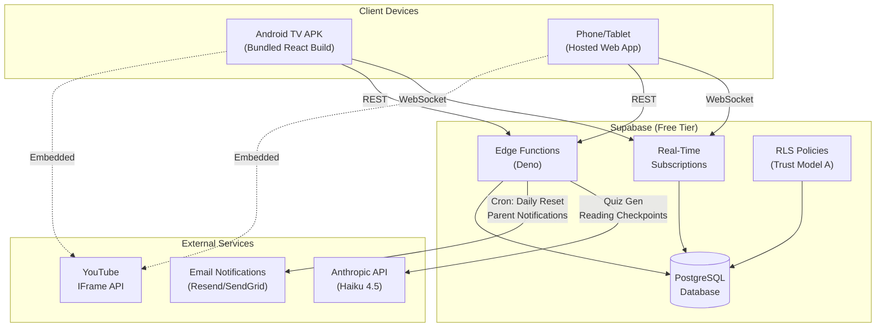

# Master Architecture Specification: QuestTrack Academy
**Version:** 2
**SOW Reference:** questtrack-academy-sow-v2.md
**Date:** July 6, 2026
**Status:** LOCKED (pending Cycle 2 re-review of RPC/RLS sections)
**Review Cycle 1:** 155 raw findings → 35 merged → 31 approved, 1 rejected, 1 partial, 2 subsumed. See questtrack-synthesis-v1-decisions.md.

---

## 1. System Architecture Overview

### 1.1 Architecture Diagram



### 1.2 Technology Stack

| Layer | Technology | Version | Rationale |
|-------|-----------|---------|-----------|
| Frontend | React + Vite | React 18+, Vite 5+ | Component tree architecture. Static build output for APK bundling |
| Styling | Tailwind CSS | 3.4+ | Utility-first, TV-scale typography, dark theme tokens |
| Icons | Lucide React | Latest | Tree-shakeable, consistent style |
| Fonts | Google Fonts CDN | — | Fredoka (headings), Quicksand (body) |
| Database | Supabase PostgreSQL | Free tier | Normalized relational schema, real-time subscriptions, RLS, Edge Functions |
| Real-Time | Supabase Realtime | — | WebSocket push for multi-device sync (F-024) |
| Serverless | Supabase Edge Functions | Deno | API proxy for Anthropic, cron for resets/notifications, PIN verification, all parent-privileged writes |
| AI | Anthropic API (Haiku 4.5) | — | Quiz generation, reading checkpoints. Proxied via Edge Functions |
| Video | YouTube IFrame API | v3 | Embedded lessons with overlay control |
| Particles | canvas-confetti | 1.9+ | Hardware-accelerated celebration effects |
| TV Build | Capacitor | 5+ | Bundles React build into APK assets |
| Web Hosting | Netlify or Vercel | — | Phone/tablet access via hosted URL |

### 1.3 Deployment Topology

**TV (Android TV / Fire TV):**
- React build bundled inside Capacitor APK `/android/app/src/main/assets/`
- APK loads app locally — no network needed for shell boot
- Supabase syncs when online; local cache when offline
- Updates: plain `fetch()` checks `app_version` table on mount and `visibilitychange`. If new version available, show update-available banner. Major updates require APK re-sideload. **(C1-011: no Service Workers — TV WebViews don't support them)**

**Phone/Tablet (Web):**
- Hosted on Netlify/Vercel at `https://questtrack.yourdomain.com`
- Same React build, standard browser access
- Auto-updates on deploy
- Parent CRUD (text entry) happens here — TV is read-only admin

---

## 2. Database Schema

### 2.1 Entity Relationship Diagram

```mermaid
erDiagram
    families ||--o{ kids : has
    families {
        uuid id PK
        text family_name
        text pin_hash "bcrypt — excluded from client view"
        int pin_attempts "excluded from client view"
        timestamptz pin_locked_until "excluded from client view"
        boolean force_morning_boost
        int auto_approve_hours "default 48, 0=disabled"
        timestamptz created_at
    }

    kids {
        uuid id PK
        uuid family_id FK
        text name
        text avatar_emoji
        text color_name
        text color_hex
        int level
        int xp "CHECK (xp >= 0)"
        int coins "CHECK (coins >= 0)"
        int daily_xp_earned "reset to 0 by daily-reset cron"
        int current_grade
        text soft_lock_hash "SHA-256 of sequence, not plaintext"
        timestamptz last_read_date
        int reading_streak
        timestamptz created_at
    }

    kids ||--o{ chore_events : completes
    kids ||--o{ quiz_attempts : takes
    kids ||--o{ book_progress : reads
    kids ||--o{ reward_redemptions : purchases

    chore_definitions ||--o{ chore_events : tracked_by
    chore_definitions {
        uuid id PK
        uuid family_id FK
        text title
        text frequency "CHECK IN (daily, weekly, monthly)"
        int xp_reward
        int coin_reward
        boolean is_active
        int sort_order
        timestamptz deleted_at "soft delete"
        timestamptz created_at
    }

    chore_events {
        uuid id PK
        uuid kid_id FK
        uuid chore_id FK
        text status "CHECK IN (completed, pending_approval, approved, rejected, reset)"
        uuid mutation_id "client-generated idempotency key"
        timestamptz completed_at
        timestamptz reviewed_at
        int xp_awarded
        int coins_awarded
        text reset_period "CHECK IN (daily, weekly, monthly)"
        date period_date
    }

    modules {
        uuid id PK
        text subject "CHECK IN (math, ela, science, social_studies)"
        int grade_level
        text module_name
        text module_icon
        text[] standard_codes "array of NYS codes"
        int sort_order
    }

    modules ||--o{ lessons : contains
    lessons {
        uuid id PK
        uuid module_id FK
        text lesson_name
        text video_type "CHECK IN (youtube, mp4)"
        text video_id
        text video_url
        text fallback_video_id "backup YouTube ID per C1-022"
        int duration_seconds
        text standard_code
        int sort_order
        timestamptz deleted_at "soft delete"
    }

    lessons ||--o{ quiz_attempts : generates
    quiz_attempts {
        uuid id PK
        uuid kid_id FK
        uuid lesson_id FK
        jsonb questions "slim after 30d: {standard_code, is_correct, selected_index}[]"
        jsonb answers "slim after 30d"
        int score
        int max_score
        int coins_awarded
        int xp_awarded
        text difficulty_tier "CHECK IN (bronze, silver, gold)"
        boolean early_bird_active
        uuid mutation_id "idempotency key"
        timestamptz completed_at
    }

    fallback_questions {
        uuid id PK
        uuid module_id FK
        text question
        jsonb options "text[]"
        int correct_index
        text explanation
        text standard_code
    }

    app_version {
        uuid id PK
        text version_string
        text download_url
        boolean force_update
        timestamptz released_at
    }

    books {
        uuid id PK
        text title
        text author
        int tier "CHECK IN (1, 2, 3)"
        text genre
        int lexile
        int pages
        int total_chapters
        jsonb checkpoint_chapters
        jsonb chapter_summaries "2-3 sentences per checkpoint for AI context"
        jsonb curriculum_connections
        text cover_url
    }

    books ||--o{ book_progress : tracked_in
    book_progress {
        uuid id PK
        uuid kid_id FK
        uuid book_id FK "UNIQUE(kid_id, book_id)"
        int current_chapter
        text status "CHECK IN (assigned, reading, completed)"
        int star_rating
        text reflection_text "mobile/web only — nullable"
        timestamptz started_at
        timestamptz completed_at
    }

    book_progress ||--o{ reading_checkpoints : has
    reading_checkpoints {
        uuid id PK
        uuid book_progress_id FK
        int chapter_number
        jsonb questions
        jsonb answers
        int score
        int xp_awarded
        int coins_awarded
        timestamptz completed_at
    }

    calendar_events {
        uuid id PK
        uuid family_id FK
        text title
        text category "CHECK IN (extracurricular, medical, school, family, other)"
        uuid kid_id FK "nullable — null = family-wide"
        timestamptz event_start
        timestamptz event_end
        text recurrence_rule "iCal RRULE string"
        boolean is_someday
        timestamptz created_at
    }

    rewards {
        uuid id PK
        uuid family_id FK
        text title
        int cost
        text icon
        text bg_class
        int max_per_day
        boolean is_active
        timestamptz deleted_at "soft delete"
        timestamptz created_at
    }

    rewards ||--o{ reward_redemptions : purchased_via
    reward_redemptions {
        uuid id PK
        uuid kid_id FK
        uuid reward_id FK
        int coins_spent
        timestamptz redeemed_at
    }

    system_state {
        uuid id PK
        uuid family_id FK
        timestamptz last_daily_reset
        timestamptz last_weekly_reset
        timestamptz last_monthly_reset
    }

    processed_mutations {
        uuid mutation_id PK
        timestamptz processed_at
    }

    calendar_events }o--o| kids : assigned_to
```



### 2.2 Indexes (created in initial migration)

```sql
-- C1-018: All performance-critical indexes
CREATE INDEX idx_chore_events_kid_period ON chore_events (kid_id, period_date, status);
CREATE INDEX idx_quiz_attempts_kid_date ON quiz_attempts (kid_id, completed_at);
CREATE INDEX idx_book_progress_kid_book ON book_progress (kid_id, book_id);
CREATE INDEX idx_calendar_events_family_start ON calendar_events (family_id, event_start);
CREATE INDEX idx_reward_redemptions_kid_date ON reward_redemptions (kid_id, redeemed_at);
CREATE INDEX idx_reading_checkpoints_progress ON reading_checkpoints (book_progress_id);
CREATE INDEX idx_fallback_questions_module ON fallback_questions (module_id);

-- C1-004: Prevent duplicate chore completions (offline replay guard)
CREATE UNIQUE INDEX ux_chore_events_active
    ON chore_events (kid_id, chore_id, period_date)
    WHERE status IN ('completed', 'pending_approval');
```

### 2.3 Constraints Summary

```sql
-- C1-025: CHECK constraints (not ENUMs — easier to alter for grade expansion)
ALTER TABLE kids ADD CHECK (coins >= 0);
ALTER TABLE kids ADD CHECK (xp >= 0);
ALTER TABLE kids ADD CHECK (daily_xp_earned >= 0);
ALTER TABLE chore_definitions ADD CHECK (frequency IN ('daily', 'weekly', 'monthly'));
ALTER TABLE chore_events ADD CHECK (status IN ('completed', 'pending_approval', 'approved', 'rejected', 'reset'));
ALTER TABLE modules ADD CHECK (subject IN ('math', 'ela', 'science', 'social_studies'));
ALTER TABLE lessons ADD CHECK (video_type IN ('youtube', 'mp4'));
ALTER TABLE quiz_attempts ADD CHECK (difficulty_tier IN ('bronze', 'silver', 'gold'));
ALTER TABLE book_progress ADD CHECK (status IN ('assigned', 'reading', 'completed'));
ALTER TABLE books ADD CHECK (tier IN (1, 2, 3));
ALTER TABLE calendar_events ADD CHECK (category IN ('extracurricular', 'medical', 'school', 'family', 'other'));

-- C1-023: FK cascade behavior — RESTRICT everywhere, soft deletes for admin-managed entities
-- ON DELETE RESTRICT on all FKs. Admin "delete" sets deleted_at. Active queries filter WHERE deleted_at IS NULL.

-- C1-014: Unique book assignment per kid
ALTER TABLE book_progress ADD CONSTRAINT uq_book_progress_kid_book UNIQUE (kid_id, book_id);
```

### 2.4 Purpose-Specific RPC Functions (C1-001)

The generic `award_currency(p_kid_id, p_coins, p_xp)` is **removed**. All economy mutations use purpose-specific RPCs that look up amounts server-side. Client never passes coin/xp values.

```sql
-- ============================================================
-- complete_chore: kid marks a chore done
-- ============================================================
CREATE OR REPLACE FUNCTION complete_chore(
    p_chore_event_id uuid,
    p_mutation_id uuid
) RETURNS json AS $$
DECLARE
    v_event chore_events%ROWTYPE;
    v_chore chore_definitions%ROWTYPE;
    v_kid kids%ROWTYPE;
    v_daily_cap CONSTANT int := 200;
    v_xp_to_award int;
    v_leveled_up boolean := false;
    v_new_level int;
BEGIN
    -- Idempotency check
    IF EXISTS (SELECT 1 FROM processed_mutations WHERE mutation_id = p_mutation_id) THEN
        RETURN json_build_object('status', 'already_processed');
    END IF;

    -- Lock the event row
    SELECT * INTO v_event FROM chore_events WHERE id = p_chore_event_id FOR UPDATE;
    IF NOT FOUND OR v_event.status != 'reset' THEN
        RETURN json_build_object('status', 'invalid_state');
    END IF;

    -- Look up reward amounts server-side
    SELECT * INTO v_chore FROM chore_definitions WHERE id = v_event.chore_id AND deleted_at IS NULL;
    SELECT * INTO v_kid FROM kids WHERE id = v_event.kid_id FOR UPDATE;

    -- Enforce daily XP cap
    v_xp_to_award := LEAST(v_chore.xp_reward, v_daily_cap - v_kid.daily_xp_earned);
    IF v_xp_to_award < 0 THEN v_xp_to_award := 0; END IF;

    -- Apply updates
    UPDATE chore_events SET
        status = 'completed',
        completed_at = now(),
        xp_awarded = v_xp_to_award,
        coins_awarded = v_chore.coin_reward,
        mutation_id = p_mutation_id
    WHERE id = p_chore_event_id;

    UPDATE kids SET
        coins = coins + v_chore.coin_reward,
        xp = xp + v_xp_to_award,
        daily_xp_earned = daily_xp_earned + v_xp_to_award
    WHERE id = v_kid.id;

    -- Level-up check (re-select to get accurate values)
    SELECT * INTO v_kid FROM kids WHERE id = v_kid.id FOR UPDATE;
    IF v_kid.xp >= 100 THEN
        UPDATE kids SET
            level = level + (xp / 100),
            xp = xp % 100
        WHERE id = v_kid.id
        RETURNING level INTO v_new_level;
        v_leveled_up := true;
    END IF;

    -- Record processed mutation
    INSERT INTO processed_mutations (mutation_id, processed_at) VALUES (p_mutation_id, now());

    -- Re-select final state for accurate return
    SELECT * INTO v_kid FROM kids WHERE id = v_kid.id;

    RETURN json_build_object(
        'status', 'success',
        'coins', v_kid.coins,
        'xp', v_kid.xp,
        'level', v_kid.level,
        'daily_xp_earned', v_kid.daily_xp_earned,
        'leveled_up', v_leveled_up,
        'xp_awarded', v_xp_to_award,
        'coins_awarded', v_chore.coin_reward
    );
END;
$$ LANGUAGE plpgsql SECURITY DEFINER;

-- ============================================================
-- submit_quiz: grade quiz + award XP/coins + Early Bird
-- ============================================================
CREATE OR REPLACE FUNCTION submit_quiz(
    p_kid_id uuid,
    p_lesson_id uuid,
    p_answers jsonb,
    p_questions jsonb,
    p_score int,
    p_max_score int,
    p_difficulty_tier text,
    p_mutation_id uuid
) RETURNS json AS $$
DECLARE
    v_kid kids%ROWTYPE;
    v_lesson lessons%ROWTYPE;
    v_module modules%ROWTYPE;
    v_daily_cap CONSTANT int := 200;
    v_base_xp int;
    v_base_coins int;
    v_xp_to_award int;
    v_coins_to_award int;
    v_is_early_bird boolean := false;
    v_family families%ROWTYPE;
    v_current_hour int;
    v_leveled_up boolean := false;
    v_new_level int;
BEGIN
    -- Idempotency
    IF EXISTS (SELECT 1 FROM processed_mutations WHERE mutation_id = p_mutation_id) THEN
        RETURN json_build_object('status', 'already_processed');
    END IF;

    SELECT * INTO v_kid FROM kids WHERE id = p_kid_id FOR UPDATE;
    SELECT * INTO v_lesson FROM lessons WHERE id = p_lesson_id;
    SELECT * INTO v_family FROM families WHERE id = v_kid.family_id;

    -- Calculate base rewards from score
    v_base_xp := p_score * 10;  -- 10 XP per correct answer
    v_base_coins := p_score * 5; -- 5 coins per correct answer

    -- C1-017: Early Bird — server-side only, no offline fallback
    v_current_hour := EXTRACT(HOUR FROM (now() AT TIME ZONE 'America/New_York'));
    IF (v_current_hour >= 5 AND v_current_hour < 9) OR v_family.force_morning_boost THEN
        -- Check first-completion-per-lesson-per-day
        IF NOT EXISTS (
            SELECT 1 FROM quiz_attempts
            WHERE kid_id = p_kid_id AND lesson_id = p_lesson_id
            AND completed_at::date = (now() AT TIME ZONE 'America/New_York')::date
            AND early_bird_active = true
        ) THEN
            v_is_early_bird := true;
            v_base_xp := v_base_xp * 2;
            v_base_coins := v_base_coins + 20;
        END IF;
    END IF;

    -- Enforce daily XP cap
    v_xp_to_award := LEAST(v_base_xp, v_daily_cap - v_kid.daily_xp_earned);
    IF v_xp_to_award < 0 THEN v_xp_to_award := 0; END IF;
    v_coins_to_award := v_base_coins;

    -- Insert quiz attempt
    INSERT INTO quiz_attempts (
        id, kid_id, lesson_id, questions, answers, score, max_score,
        coins_awarded, xp_awarded, difficulty_tier, early_bird_active, mutation_id, completed_at
    ) VALUES (
        gen_random_uuid(), p_kid_id, p_lesson_id, p_questions, p_answers,
        p_score, p_max_score, v_coins_to_award, v_xp_to_award,
        p_difficulty_tier, v_is_early_bird, p_mutation_id, now()
    );

    -- Update kid balances
    UPDATE kids SET
        coins = coins + v_coins_to_award,
        xp = xp + v_xp_to_award,
        daily_xp_earned = daily_xp_earned + v_xp_to_award
    WHERE id = p_kid_id;

    -- Level-up
    SELECT * INTO v_kid FROM kids WHERE id = p_kid_id FOR UPDATE;
    IF v_kid.xp >= 100 THEN
        UPDATE kids SET
            level = level + (xp / 100),
            xp = xp % 100
        WHERE id = p_kid_id
        RETURNING level INTO v_new_level;
        v_leveled_up := true;
    END IF;

    INSERT INTO processed_mutations (mutation_id, processed_at) VALUES (p_mutation_id, now());

    SELECT * INTO v_kid FROM kids WHERE id = p_kid_id;

    RETURN json_build_object(
        'status', 'success',
        'coins', v_kid.coins,
        'xp', v_kid.xp,
        'level', v_kid.level,
        'daily_xp_earned', v_kid.daily_xp_earned,
        'leveled_up', v_leveled_up,
        'early_bird_active', v_is_early_bird,
        'xp_awarded', v_xp_to_award,
        'coins_awarded', v_coins_to_award
    );
END;
$$ LANGUAGE plpgsql SECURITY DEFINER;

-- ============================================================
-- redeem_reward: atomic coin deduction + redemption record
-- ============================================================
CREATE OR REPLACE FUNCTION redeem_reward(
    p_kid_id uuid,
    p_reward_id uuid,
    p_mutation_id uuid
) RETURNS json AS $$
DECLARE
    v_kid kids%ROWTYPE;
    v_reward rewards%ROWTYPE;
    v_today_count int;
BEGIN
    -- Idempotency
    IF EXISTS (SELECT 1 FROM processed_mutations WHERE mutation_id = p_mutation_id) THEN
        RETURN json_build_object('status', 'already_processed');
    END IF;

    SELECT * INTO v_reward FROM rewards WHERE id = p_reward_id AND deleted_at IS NULL AND is_active = true;
    IF NOT FOUND THEN
        RETURN json_build_object('status', 'reward_not_found');
    END IF;

    SELECT * INTO v_kid FROM kids WHERE id = p_kid_id FOR UPDATE;

    -- Check balance
    IF v_kid.coins < v_reward.cost THEN
        RETURN json_build_object('status', 'insufficient_coins', 'coins', v_kid.coins, 'cost', v_reward.cost);
    END IF;

    -- Check daily limit
    SELECT COUNT(*) INTO v_today_count
    FROM reward_redemptions
    WHERE kid_id = p_kid_id AND reward_id = p_reward_id
    AND redeemed_at::date = CURRENT_DATE;

    IF v_today_count >= v_reward.max_per_day THEN
        RETURN json_build_object('status', 'daily_limit_reached');
    END IF;

    -- Deduct and record
    UPDATE kids SET coins = coins - v_reward.cost WHERE id = p_kid_id;
    INSERT INTO reward_redemptions (id, kid_id, reward_id, coins_spent, redeemed_at)
    VALUES (gen_random_uuid(), p_kid_id, p_reward_id, v_reward.cost, now());

    INSERT INTO processed_mutations (mutation_id, processed_at) VALUES (p_mutation_id, now());

    SELECT * INTO v_kid FROM kids WHERE id = p_kid_id;

    RETURN json_build_object(
        'status', 'success',
        'coins', v_kid.coins,
        'reward_title', v_reward.title
    );
END;
$$ LANGUAGE plpgsql SECURITY DEFINER;

-- ============================================================
-- perform_daily_reset: atomic cron + catch-up guard (C1-008)
-- ============================================================
CREATE OR REPLACE FUNCTION perform_daily_reset(
    p_family_id uuid,
    p_target_date date DEFAULT CURRENT_DATE
) RETURNS json AS $$
DECLARE
    v_state system_state%ROWTYPE;
    v_day_of_week int;
    v_day_of_month int;
    v_approved_count int := 0;
    v_auto_approve_hours int;
BEGIN
    -- Atomic guard: only one caller wins
    UPDATE system_state
    SET last_daily_reset = now()
    WHERE family_id = p_family_id AND last_daily_reset::date < p_target_date
    RETURNING * INTO v_state;

    IF NOT FOUND THEN
        RETURN json_build_object('status', 'already_reset');
    END IF;

    -- C1-020: Auto-approve old pending items
    SELECT auto_approve_hours INTO v_auto_approve_hours FROM families WHERE id = p_family_id;
    IF v_auto_approve_hours > 0 THEN
        UPDATE chore_events SET status = 'approved', reviewed_at = now()
        WHERE status = 'pending_approval'
        AND completed_at < now() - (v_auto_approve_hours || ' hours')::interval
        AND kid_id IN (SELECT id FROM kids WHERE family_id = p_family_id);
        GET DIAGNOSTICS v_approved_count = ROW_COUNT;
    END IF;

    -- Transition completed → pending_approval for yesterday
    UPDATE chore_events SET status = 'pending_approval'
    WHERE status = 'completed'
    AND kid_id IN (SELECT id FROM kids WHERE family_id = p_family_id)
    AND period_date < p_target_date;

    -- Reset daily_xp_earned for all kids
    UPDATE kids SET daily_xp_earned = 0 WHERE family_id = p_family_id;

    -- Insert new daily reset events
    INSERT INTO chore_events (id, kid_id, chore_id, status, reset_period, period_date)
    SELECT gen_random_uuid(), k.id, cd.id, 'reset', 'daily', p_target_date
    FROM kids k
    CROSS JOIN chore_definitions cd
    WHERE k.family_id = p_family_id
    AND cd.family_id = p_family_id
    AND cd.frequency = 'daily'
    AND cd.is_active = true
    AND cd.deleted_at IS NULL
    ON CONFLICT DO NOTHING;  -- unique index handles dedup

    -- Weekly reset (Monday)
    v_day_of_week := EXTRACT(ISODOW FROM p_target_date);
    IF v_day_of_week = 1 AND v_state.last_weekly_reset::date < p_target_date THEN
        UPDATE system_state SET last_weekly_reset = now() WHERE family_id = p_family_id;
        INSERT INTO chore_events (id, kid_id, chore_id, status, reset_period, period_date)
        SELECT gen_random_uuid(), k.id, cd.id, 'reset', 'weekly', p_target_date
        FROM kids k CROSS JOIN chore_definitions cd
        WHERE k.family_id = p_family_id AND cd.family_id = p_family_id
        AND cd.frequency = 'weekly' AND cd.is_active = true AND cd.deleted_at IS NULL
        ON CONFLICT DO NOTHING;
    END IF;

    -- Monthly reset (1st)
    v_day_of_month := EXTRACT(DAY FROM p_target_date);
    IF v_day_of_month = 1 AND v_state.last_monthly_reset::date < p_target_date THEN
        UPDATE system_state SET last_monthly_reset = now() WHERE family_id = p_family_id;
        INSERT INTO chore_events (id, kid_id, chore_id, status, reset_period, period_date)
        SELECT gen_random_uuid(), k.id, cd.id, 'reset', 'monthly', p_target_date
        FROM kids k CROSS JOIN chore_definitions cd
        WHERE k.family_id = p_family_id AND cd.family_id = p_family_id
        AND cd.frequency = 'monthly' AND cd.is_active = true AND cd.deleted_at IS NULL
        ON CONFLICT DO NOTHING;
    END IF;

    RETURN json_build_object(
        'status', 'success',
        'target_date', p_target_date,
        'auto_approved', v_approved_count
    );
END;
$$ LANGUAGE plpgsql SECURITY DEFINER;
```

### 2.5 Analytics Views (C1-030)

```sql
-- Per-kid analytics for parent dashboard
CREATE VIEW kid_analytics AS
SELECT
    k.id AS kid_id,
    k.name,
    k.level,
    k.xp,
    k.coins,
    k.reading_streak,
    -- Chore stats (rolling 7 days)
    (SELECT COUNT(*) FROM chore_events ce
     WHERE ce.kid_id = k.id AND ce.status = 'approved'
     AND ce.period_date >= CURRENT_DATE - 7) AS chores_approved_7d,
    (SELECT COUNT(*) FROM chore_events ce
     WHERE ce.kid_id = k.id AND ce.status = 'pending_approval') AS chores_pending,
    -- Quiz stats
    (SELECT COUNT(*) FROM quiz_attempts qa
     WHERE qa.kid_id = k.id) AS total_quizzes,
    (SELECT ROUND(AVG(qa.score::float / NULLIF(qa.max_score, 0) * 100))
     FROM quiz_attempts qa WHERE qa.kid_id = k.id) AS avg_quiz_pct,
    -- Books
    (SELECT COUNT(*) FROM book_progress bp
     WHERE bp.kid_id = k.id AND bp.status = 'completed') AS books_completed,
    (SELECT COUNT(*) FROM book_progress bp
     WHERE bp.kid_id = k.id AND bp.status = 'reading') AS books_reading
FROM kids k;

-- C1-013: Weekly completion rate for progressive ramp trigger
CREATE VIEW weekly_completion_rate AS
SELECT
    k.id AS kid_id,
    k.name,
    COUNT(CASE WHEN ce.status = 'approved' THEN 1 END)::float /
    NULLIF(COUNT(*), 0) * 100 AS completion_pct
FROM kids k
JOIN chore_events ce ON ce.kid_id = k.id
WHERE ce.period_date >= CURRENT_DATE - 7
AND ce.reset_period = 'daily'
GROUP BY k.id, k.name;
```

### 2.6 Data Retention (C1-012, C1-031)

```sql
-- pg_cron job: slim quiz_attempts JSONB after 30 days
-- Preserves: {standard_code, is_correct, selected_index}[] per question
-- Purges: full question text, explanations, option text
SELECT cron.schedule(
    'slim-quiz-jsonb',
    '0 3 * * *',  -- 3 AM daily
    $$
    UPDATE quiz_attempts
    SET questions = (
        SELECT jsonb_agg(jsonb_build_object(
            'standard_code', q->>'standard_code',
            'is_correct', (q->>'is_correct')::boolean,
            'selected_index', (q->>'selected_index')::int
        ))
        FROM jsonb_array_elements(questions) AS q
    ),
    answers = NULL
    WHERE completed_at < now() - interval '30 days'
    AND jsonb_array_length(questions) > 0
    AND questions->0 ? 'question'  -- only if full payload still present
    $$
);
```

### 2.7 Key Schema Decisions

**Chore status transitions:**
```
State Machine: reset → completed → pending_approval → approved/rejected
                                                         ↑
                                     (midnight cron + catch-up on mount)
```

**Recurring events:** Stored as iCal RRULE strings, expanded client-side within bounded `[view_start, view_end]` window only (C1-024). Memoized per event/range. rrule.js version pinned.

```sql
-- Example: Soccer every Tuesday at 4:30 PM
INSERT INTO calendar_events (title, event_start, recurrence_rule, kid_id)
VALUES ('⚽ Soccer Practice', '2026-07-08T16:30:00Z', 'FREQ=WEEKLY;BYDAY=TU', '<quinn_uuid>');
```

### 2.8 Seed Data

- Default family record with hashed PIN (1234), auto_approve_hours = 48
- Quinn and Cora kid records with starting stats (level 1, 0 xp, 0 coins)
- 17 curriculum modules + 73 lessons with video IDs + fallback_video_ids
- 20 books with chapter summaries
- ~200 fallback quiz questions (~50 per subject)
- ~30 suggested chore bank
- 3 starter daily chores, 1 weekly, 0 monthly (progressive ramp)
- 3 default reward shop items
- 1 starter book assigned per kid

### 2.9 Migrations Strategy

Supabase migrations via CLI (`supabase migration new`). Each phase creates its own migration file. Rollback via `supabase migration revert`. JSONB internal schemas documented in migration comments.

---

## 3. Security & Trust Model (C1-002, C1-003)

### 3.1 Trust Model A: Single-Tenant, No Supabase Auth

This is a single-family app on sideloaded devices. There are no user accounts, no JWTs, no Supabase Auth.

**Identity model:**
- Single `family_id` hardcoded in app config
- All clients connect with Supabase anon key
- Kids identified by profile selection (soft-lock gate, not authentication)
- Parents identified by PIN verification (server-side)

**Threat model:**
- **Primary threat:** 8-year-olds manipulating the coin/XP economy
- **Secondary threat:** Sibling interference with each other's profiles
- **Out of scope:** External attackers, network-level threats (private family WiFi)

### 3.2 RLS Policies

```sql
-- All tables use permissive read for the single family
ALTER TABLE families ENABLE ROW LEVEL SECURITY;
ALTER TABLE kids ENABLE ROW LEVEL SECURITY;
ALTER TABLE chore_definitions ENABLE ROW LEVEL SECURITY;
ALTER TABLE chore_events ENABLE ROW LEVEL SECURITY;
ALTER TABLE modules ENABLE ROW LEVEL SECURITY;
ALTER TABLE lessons ENABLE ROW LEVEL SECURITY;
ALTER TABLE quiz_attempts ENABLE ROW LEVEL SECURITY;
ALTER TABLE books ENABLE ROW LEVEL SECURITY;
ALTER TABLE book_progress ENABLE ROW LEVEL SECURITY;
ALTER TABLE reading_checkpoints ENABLE ROW LEVEL SECURITY;
ALTER TABLE calendar_events ENABLE ROW LEVEL SECURITY;
ALTER TABLE rewards ENABLE ROW LEVEL SECURITY;
ALTER TABLE reward_redemptions ENABLE ROW LEVEL SECURITY;
ALTER TABLE system_state ENABLE ROW LEVEL SECURITY;
ALTER TABLE fallback_questions ENABLE ROW LEVEL SECURITY;
ALTER TABLE app_version ENABLE ROW LEVEL SECURITY;

-- READ: all tables readable (single family)
CREATE POLICY "anon_read" ON families FOR SELECT USING (true);
CREATE POLICY "anon_read" ON kids FOR SELECT USING (true);
CREATE POLICY "anon_read" ON chore_definitions FOR SELECT USING (true);
CREATE POLICY "anon_read" ON chore_events FOR SELECT USING (true);
CREATE POLICY "anon_read" ON modules FOR SELECT USING (true);
CREATE POLICY "anon_read" ON lessons FOR SELECT USING (true);
CREATE POLICY "anon_read" ON quiz_attempts FOR SELECT USING (true);
CREATE POLICY "anon_read" ON books FOR SELECT USING (true);
CREATE POLICY "anon_read" ON book_progress FOR SELECT USING (true);
CREATE POLICY "anon_read" ON reading_checkpoints FOR SELECT USING (true);
CREATE POLICY "anon_read" ON calendar_events FOR SELECT USING (true);
CREATE POLICY "anon_read" ON rewards FOR SELECT USING (true);
CREATE POLICY "anon_read" ON reward_redemptions FOR SELECT USING (true);
CREATE POLICY "anon_read" ON system_state FOR SELECT USING (true);
CREATE POLICY "anon_read" ON fallback_questions FOR SELECT USING (true);
CREATE POLICY "anon_read" ON app_version FOR SELECT USING (true);

-- WRITE: kid-initiated actions go through SECURITY DEFINER RPCs (complete_chore, submit_quiz, redeem_reward)
-- No direct INSERT/UPDATE/DELETE from anon role on economy tables.
-- RPCs run as SECURITY DEFINER = superuser context, bypassing RLS.

-- WRITE: parent-privileged writes go through Edge Functions that verify PIN session token:
-- chore_definitions, calendar_events, rewards, books (assignment), families (settings)
-- Edge Functions use service_role key internally.

-- C1-003: Sensitive columns hidden via view
CREATE VIEW families_safe AS
SELECT id, family_name, force_morning_boost, auto_approve_hours, created_at
FROM families;
-- Client queries families_safe, never families directly.
-- pin_hash, pin_attempts, pin_locked_until only accessed by verify-pin Edge Function.

-- Soft-lock: stored as SHA-256 hash (C1-003). Client hashes sequence before storage/comparison.
-- Not high security — prevents casual sibling interference.
```

### 3.3 PIN Session Token Flow

```
1. Client sends PIN to verify-pin Edge Function
2. Edge Function checks bcrypt hash, rate limits (5 attempts, 5-min lockout)
3. On success: returns short-lived token (UUID, stored in families.current_session_token + expires_at)
4. Client stores token in React state (not localStorage — cleared on refresh is fine)
5. Parent-write Edge Functions (create-chore, update-calendar, etc.) require token in header
6. Token validated server-side: SELECT WHERE current_session_token = $1 AND session_expires_at > now()
7. Token expires after 30 minutes of inactivity
```

### 3.4 Data Protection

- PIN stored as bcrypt hash — only accessible via Edge Function
- Anthropic API key in Supabase Edge Function env vars only — never in client bundle
- Supabase anon key is safe to expose (designed for client-side use with RLS)
- No PII beyond first names and reading preferences
- HTTPS enforced on all connections
- IndexedDB stores cached state locally — acceptable for family device

---

## 4. API Design (Supabase Edge Functions)

### 4.1 Conventions

- Base URL: `https://<project-ref>.supabase.co/functions/v1/`
- Auth: Supabase anon key in `Authorization: Bearer` header
- Parent-write endpoints also require `X-Session-Token` header
- All Edge Functions written in Deno/TypeScript
- Error format: `{ "error": { "code": "string", "message": "string" } }`

### 4.2 Edge Function Definitions

#### `POST /functions/v1/generate-quiz` — Implements F-009

**Purpose:** Proxy quiz generation to Anthropic API. API key server-side only.

**Request:**
```json
{
    "kid_id": "uuid",
    "lesson_id": "uuid",
    "difficulty": "bronze|silver|gold",
    "question_count": 3,
    "device_type": "tv|mobile",
    "mutation_id": "uuid"
}
```

**Response (200):**
```json
{
    "questions": [
        {
            "question": "string",
            "options": ["A) ...", "B) ...", "C) ...", "D) ..."],
            "correct_index": 0,
            "explanation": "string",
            "standard_code": "NY-3.OA.1"
        }
    ]
}
```

**Logic:**
1. Check mutation_id idempotency (C1-028)
2. Fetch lesson + module data from DB
3. Call Anthropic Haiku with 4-second AbortController timeout
4. **On timeout:** query `fallback_questions` table for this module. If Supabase unreachable, fall through to client-bundled JSON (tier-2 only)
5. **C1-006:** All questions are multiple-choice regardless of device. `device_type` reserved for future open-response on mobile.

**AI Prompt Requirements (C1-026):**
- System prompt specifies: 3rd grade reading level, growth-mindset tone, max explanation 2 sentences
- Prohibited language: "wrong", "incorrect", "failed", "you should have known"
- Required tone: encouraging, curious, celebratory on correct answers
- Format: always 4 options (A-D), one correct, explanation for correct answer

#### `POST /functions/v1/generate-checkpoint` — Implements F-011

**Purpose:** Generate reading comprehension checkpoint questions for a book chapter.

**Request:**
```json
{
    "kid_id": "uuid",
    "book_id": "uuid",
    "chapter_number": 6,
    "kid_name": "Cora",
    "device_type": "tv|mobile"
}
```

**Logic:** Fetches `chapter_summaries` JSONB from `books` table for the given chapter. Passes summary into Anthropic system prompt for accuracy. Same 4s timeout + fallback. **On TV: MC-only (C1-006). On mobile: may include open-response.**

#### `POST /functions/v1/verify-pin` — Implements F-017

**Purpose:** Server-side PIN verification with rate limiting.

**Logic:** Compares bcrypt hash. Increments `pin_attempts`. Locks for 5 minutes after 5 failures. On success, generates session token (UUID), stores in families table with 30-min expiry, returns token to client.

#### `CRON /functions/v1/daily-reset` — Implements F-014

**Purpose:** Runs on Supabase cron schedule **every hour**. Edge Function checks `now() AT TIME ZONE 'America/New_York'` — only executes reset logic if current ET hour is midnight AND last_daily_reset < today (C1-016).

**Logic:**
1. Call `perform_daily_reset()` RPC for the family (atomic guard prevents double-execution)
2. Multi-day catch-up: if `last_daily_reset` is >1 day old, iterate each missed day sequentially (C1-034/C1-008)
3. Send parent notification email via Resend/SendGrid

#### Parent-Write Edge Functions (require session token)

All gated by `X-Session-Token` header validated against `families.current_session_token`.

| Endpoint | Purpose |
|----------|---------|
| `POST /create-chore` | Add chore_definition |
| `PUT /update-chore` | Edit chore_definition |
| `DELETE /delete-chore` | Set deleted_at on chore_definition |
| `POST /create-calendar-event` | Add calendar_event |
| `PUT /update-calendar-event` | Edit calendar_event |
| `DELETE /delete-calendar-event` | Hard delete calendar_event |
| `POST /assign-book` | Create book_progress for kid |
| `POST /approve-chore` | Set chore_event status to approved |
| `POST /reject-chore` | Set chore_event status to rejected, claw back coins/xp |
| `PUT /update-family-settings` | Toggle force_morning_boost, auto_approve_hours, etc. |
| `POST /create-reward` | Add reward |
| `PUT /update-reward` | Edit reward |
| `DELETE /delete-reward` | Set deleted_at on reward |
| `POST /reset-soft-lock` | Reset kid's soft_lock_hash |

---

## 5. Component Architecture

### 5.1 Component Tree

```
src/
├── main.jsx                        — React root, Supabase provider
├── App.jsx                         — Route shell, spatial nav provider
├── hooks/
│   ├── useSpatialNav.js            — D-pad navigation engine (F-001)
│   ├── useSupabase.js              — Real-time subscriptions + offline cache
│   ├── useVisibilityReconnect.js   — TV wake handler
│   ├── useEconomy.js               — Purpose-specific RPC calls (complete_chore, submit_quiz, redeem_reward)
│   ├── useCatchUpReset.js          — Check/execute missed resets on mount + visibilitychange
│   ├── useDebounce.js              — Input debounce for D-pad
│   ├── useDeviceType.js            — TV vs mobile detection (userAgent + screen width)
│   └── useConnectionHealth.js      — Online/offline indicator + stale-reset detection
├── components/
│   ├── layout/
│   │   ├── Header.jsx              — Brand, profile tabs, admin button
│   │   ├── Toast.jsx               — Notification toasts (F-020)
│   │   ├── ConnectionIndicator.jsx — Online/offline/syncing badge (C1-029)
│   │   └── RemoteEmulator.jsx      — Dev-only D-pad overlay
│   ├── profiles/
│   │   ├── ProfileSwitcher.jsx     — Tab bar with soft-lock gate
│   │   ├── HeroStatsHUD.jsx        — XP bar, coins, level, connection indicator
│   │   ├── SoftLockModal.jsx       — 3-button sequence entry
│   │   └── SoftLockSetup.jsx       — First-use setup per kid (parent-assisted) (C1-009)
│   ├── academy/
│   │   ├── ModuleGrid.jsx          — Subject → module cards
│   │   ├── LessonPlayer.jsx        — YouTube embed with overlay
│   │   ├── QuizEngine.jsx          — AI quiz with loading state + in-flight dedup (C1-028)
│   │   ├── QuizQuestion.jsx        — Single question with retry cap
│   │   └── EarlyBirdBanner.jsx     — Sunrise boost indicator (F-016)
│   ├── reading/
│   │   ├── BookLibrary.jsx         — Tiered book grid + "Currently Reading" shelf
│   │   ├── BookDetail.jsx          — Progress, chapter log button
│   │   ├── ChapterCheckpoint.jsx   — AI comprehension questions (MC on TV)
│   │   └── BookReflection.jsx      — Post-reading review + rating (mobile/web only)
│   ├── quests/
│   │   ├── QuestBoard.jsx          — Daily/Weekly/Monthly sections
│   │   └── ChoreCard.jsx           — Toggle with debounce
│   ├── calendar/
│   │   ├── CalendarView.jsx        — TV: week-list/agenda; Mobile: week + month grid (C1-010)
│   │   ├── EventCard.jsx           — Color-coded event display
│   │   └── SomedayBucket.jsx       — Undated wishlist
│   ├── shop/
│   │   ├── RewardGrid.jsx          — Prize cards
│   │   └── PurchaseConfirm.jsx     — Hold-to-buy with progress indicator (C1-032)
│   ├── admin/
│   │   ├── ParentPinPad.jsx        — Custom numpad modal (F-017)
│   │   ├── AdminDashboard.jsx      — Analytics via kid_analytics view (F-018)
│   │   ├── ApprovalQueue.jsx       — Yesterday's chore review + claw-back toast (C1-027)
│   │   ├── ChoreBuilder.jsx        — CRUD (mobile/web only) — Phase 2 (C1-021)
│   │   ├── EventBuilder.jsx        — Calendar CRUD (mobile/web only)
│   │   ├── RewardBuilder.jsx       — Shop CRUD (mobile/web only) — Phase 2 (C1-021)
│   │   ├── BookAssigner.jsx        — Assign books + auto-suggest next (C1-014)
│   │   ├── ProgressiveRamp.jsx     — "Ready to grow" suggestion (C1-013, parent-only)
│   │   └── StaleResetBanner.jsx    — Warning if >26h since last reset (C1-029)
│   ├── onboarding/
│   │   ├── FirstVisitHints.jsx     — Lightweight navigation tutorial on TV (C1-005)
│   │   ├── EmptyQuestBoard.jsx     — Illustrated empty state
│   │   ├── EmptyBookLibrary.jsx    — Illustrated empty state
│   │   ├── EmptyCalendar.jsx       — Illustrated empty state
│   │   └── EmptyApprovalQueue.jsx  — "All caught up!" state
│   └── shared/
│       ├── LevelUpModal.jsx        — Celebration with event queue
│       ├── ConfettiCanvas.jsx      — canvas-confetti wrapper
│       ├── LoadingQuiz.jsx         — "Summoning Quiz..." blocker + cancel/back (C1-026)
│       └── PurchaseProgressIndicator.jsx — Visual fill during hold-to-confirm (C1-032)
├── lib/
│   ├── supabaseClient.js           — Supabase init + anon key
│   ├── offlineCache.js             — IndexedDB local cache + mutation queue with mutation_ids
│   ├── rruleParser.js              — Bounded [view_start, view_end] expansion, memoized (C1-024)
│   ├── clockService.js             — UTC time utilities (no offline Early Bird fallback)
│   └── constants.js                — XP cap (200), economy config, auto-approve default
└── data/
    ├── defaultChoreBank.json       — 30 suggested chores
    ├── fallbackQuizBank.json       — Tier-2 offline-only fallback (50 questions/subject)
    └── curriculumSeed.json         — 17 modules, 73 lessons, 20 books
```

### 5.2 State Management

**Supabase as source of truth.** React state is a local mirror synced via real-time subscriptions.

```
Supabase DB (authoritative)
    ↕ Real-time WebSocket (push updates)
React State (local mirror)
    ↕ IndexedDB (offline cache + mutation queue)
UI Components (render from React state)
```

**Offline strategy:** All mutations write to IndexedDB first (optimistic), then push to Supabase via RPCs. Each mutation carries a client-generated UUID `mutation_id`. On reconnect, replay queued mutations. Server-side `processed_mutations` table rejects duplicates. Conflicts: server wins for coin/XP (via RPC), last-write-wins with timestamp for other fields.

**Real-time subscriptions:** `kids`, `chore_events`, `calendar_events`, `book_progress`, `quiz_attempts`, `reward_redemptions`.

### 5.3 Spatial Navigation Engine (F-001)

Custom React hook `useSpatialNav`:

```javascript
// Core algorithm with per-profile focus memory
function useSpatialNav() {
    const [focusIndex, setFocusIndex] = useState(0);
    const focusMemory = useRef({}); // { profileId: lastFocusIndex }
    
    const moveSelection = useCallback((direction) => {
        const elements = document.querySelectorAll('.tv-focusable:not([disabled])');
        const current = elements[focusIndex].getBoundingClientRect();
        const cx = current.left + current.width / 2;
        const cy = current.top + current.height / 2;
        
        let bestIndex = -1, bestScore = Infinity;
        
        elements.forEach((el, i) => {
            if (i === focusIndex) return;
            const r = el.getBoundingClientRect();
            const dx = (r.left + r.width/2) - cx;
            const dy = (r.top + r.height/2) - cy;
            
            let valid = false;
            if (direction === 'ArrowUp' && dy < -5) valid = true;
            if (direction === 'ArrowDown' && dy > 5) valid = true;
            if (direction === 'ArrowLeft' && dx < -5) valid = true;
            if (direction === 'ArrowRight' && dx > 5) valid = true;
            
            if (valid) {
                const score = (direction === 'ArrowLeft' || direction === 'ArrowRight')
                    ? Math.abs(dx) + 1.8 * Math.abs(dy)
                    : 1.8 * Math.abs(dx) + Math.abs(dy);
                if (score < bestScore) { bestScore = score; bestIndex = i; }
            }
        });
        
        if (bestIndex !== -1) {
            setFocusIndex(bestIndex);
            elements[bestIndex].scrollIntoView({ behavior: 'smooth', block: 'nearest' });
        }
    }, [focusIndex]);
    
    useEffect(() => {
        const handler = (e) => {
            if (['ArrowUp','ArrowDown','ArrowLeft','ArrowRight','Enter'].includes(e.key)) {
                e.preventDefault();
                if (e.key === 'Enter') {
                    document.querySelectorAll('.tv-focusable')[focusIndex]?.click();
                } else {
                    moveSelection(e.key);
                }
            }
        };
        window.addEventListener('keydown', handler);
        return () => window.removeEventListener('keydown', handler);
    }, [focusIndex, moveSelection]);
    
    return { focusIndex, setFocusIndex, focusMemory };
}
```

**TV calendar navigation (C1-010):** TV defaults to week-list/agenda view. "Today" jump button (Enter). Left/Right header arrows page weeks. Full month grid reserved for mobile/tablet. `useSpatialNav` includes calendar-specific constraints for week-list navigation.

---

## 6. Integration Requirements

### 6.1 Supabase — Implements F-023, F-024

- **Auth:** Anon key only (safe to expose). RLS `USING (true)` on all tables. Parent writes via Edge Functions with session token.
- **Real-Time:** Subscribe to `kids`, `chore_events`, `calendar_events`, `book_progress`, `quiz_attempts`, `reward_redemptions`
- **Failure Handling:** `visibilitychange` reconnect. IndexedDB queue with mutation_ids for offline mutations. Connection health indicator in HeroStatsHUD (C1-029).
- **Cost:** Free tier (500MB, 50K MAU, 500K Edge Function invocations/month)

### 6.2 Anthropic API (via Edge Functions) — Implements F-009, F-011

- **Auth:** API key in Supabase Edge Function env vars
- **Model:** `claude-haiku-4-5-20251001`
- **Rate Limits:** Haiku: 25 RPM. Family use: ~5-10 RPM max
- **Timeout:** 4-second AbortController on Anthropic call. Client-side AbortController at 6-7s wrapping the full round trip (C1-028).
- **Fallback:** Tier 1: `fallback_questions` table in Supabase. Tier 2: `data/fallbackQuizBank.json` bundled in client (only if Supabase itself unreachable) (C1-007).
- **Deduplication:** Client in-flight ref guard + mutation_id idempotency key to Edge Function (C1-028).
- **Cost:** ~$1-3/month at heavy family use

### 6.3 YouTube IFrame API — Implements F-008

- **Embed params:** `?controls=0&rel=0&modestbranding=1&disablekb=1&fs=0&origin=<app-origin>`
- **Focus isolation:** Transparent overlay `<div>` blocks IFrame focus capture
- **Completion detection:** Poll `getCurrentTime()` via `setInterval` every 5s. Require ≥85% watched before quiz unlock. `onStateChange` as secondary signal.
- **Autoplay:** `WebSettings.setMediaPlaybackRequiresUserGesture(false)` in Capacitor config (C1-032)
- **Failure Handling:** If YouTube embed fails within 10s, show "Video unavailable" with skip-to-quiz option (reduced rewards). `fallback_video_id` on lessons table provides secondary YouTube ID (C1-022).

### 6.4 Capacitor — Implements TV APK Build

- **Build:** `npx cap build android` bundles React output into APK assets
- **Version Check:** Plain `fetch()` to `app_version` table on mount + `visibilitychange`. No Service Workers. (C1-011)
- **Constraints:** Android TV WebView compatibility must be tested on target hardware

---

## 7. Error Handling & Observability

### 7.1 Error Taxonomy

| Error | User Message (Toast) | Handling |
|-------|---------------------|----------|
| Supabase offline | "Saving locally — will sync when online!" | Queue in IndexedDB with mutation_id |
| Anthropic timeout | (none — seamless fallback) | Serve from fallback_questions table, then client JSON |
| YouTube embed fail | "Video unavailable — trying backup..." | Try fallback_video_id, then skip-to-quiz option |
| PIN lockout | "Too many attempts. Try again in 5 minutes." | Timer display in modal |
| RLS violation | "Something went wrong. Try again." | Log to console, don't expose |
| Chore rejected (C1-027) | "[Chore name] wasn't approved — ask a parent why!" | Toast on kid's next login. Never silent balance decrease. |
| Stale reset (C1-029) | "Daily reset may have been missed — check WiFi" | Banner in parent admin if >26h since last_daily_reset |
| Offline mutation pending | Sync spinner icon in HeroStatsHUD | Visible indicator per C1-029 |
| Quiz generation failed | "Let's try some practice questions instead!" | Actionable toast, serve fallback |

### 7.2 Logging

- Console logging in development
- Supabase Edge Function logs via `console.log` (viewable in Supabase dashboard)
- No external logging service for v1 (family app, not production SaaS)

---

## 8. Testing Strategy

### 8.1 Framework Selection

| Test Type | Framework | Coverage |
|-----------|-----------|----------|
| Unit | Vitest | Hooks, utilities, economy RPCs, clock service, rrule bounds |
| Component | Vitest + Testing Library | Quiz engine, chore toggle, spatial nav, soft-lock |
| E2E | Playwright | Full user journeys on desktop (simulating TV) |
| Visual | Claude in Chrome | TV layout, responsive, focus states, empty states |

### 8.2 Critical E2E Journeys

| Journey | Steps | Priority |
|---------|-------|----------|
| Kid completes chore | Switch profile → soft-lock → navigate to quest → check chore → verify confetti + coin increase | MUST |
| Watch video + take quiz | Select module → watch video to 85% → quiz loads → answer questions → verify rewards | MUST |
| Parent approval flow | Enter PIN → view approval queue → approve yesterday's chores → verify coins locked in | MUST |
| Chore rejection claw-back | Parent rejects chore → kid logs in → sees explanatory toast → balance reduced | MUST |
| Multi-device sync | Check chore on tablet → verify TV updates within 2 seconds | MUST |
| Offline + reconnect | Disconnect → complete chore → reconnect → verify sync via mutation replay | SHOULD |
| Daily XP cap | Earn 200 XP → attempt another quiz → verify 0 additional XP awarded | SHOULD |
| Reward purchase | Navigate to shop → hold Enter 2s → verify coins deducted + purchase indicator fills | SHOULD |
| Early Bird window | Submit quiz at 6 AM ET → verify doubled XP. Submit at 10 AM → verify base XP | SHOULD |

---

## 9. Feature-to-Component Traceability Matrix

| SOW Feature | DB Tables | Edge Functions | UI Components | Build Phase |
|-------------|-----------|----------------|---------------|-------------|
| F-001 Spatial Nav | — | — | useSpatialNav, all .tv-focusable | 1 |
| F-002 Profile Switcher | kids | — | ProfileSwitcher, SoftLockModal, SoftLockSetup | 1 |
| F-003 Hero Stats HUD | kids | — | HeroStatsHUD, ConnectionIndicator | 1 |
| F-004-007 Curriculum | modules, lessons | — | ModuleGrid, LessonPlayer | 3 |
| F-008 Video Player | lessons | — | LessonPlayer (YouTube overlay + fallback_video_id) | 3 |
| F-009 AI Quiz | quiz_attempts, fallback_questions | generate-quiz, submit_quiz RPC | QuizEngine, QuizQuestion, LoadingQuiz | 4 |
| F-010 Reading Library | books, book_progress | — | BookLibrary, BookDetail, BookReflection (mobile) | 5 |
| F-011 Reading Checkpoints | reading_checkpoints | generate-checkpoint | ChapterCheckpoint (MC on TV) | 5 |
| F-012 Daily Tasks | chore_definitions, chore_events | complete_chore RPC | QuestBoard, ChoreCard | 2 |
| F-013 Weekly Raids | chore_definitions, chore_events | complete_chore RPC | QuestBoard, ChoreCard | 2 |
| F-013b Monthly Epics | chore_definitions, chore_events | complete_chore RPC | QuestBoard, ChoreCard | 2 |
| F-013c Progressive Ramp | chore_events, weekly_completion_rate view | — | ProgressiveRamp (admin/) | 2 |
| F-014 Auto Reset | system_state, chore_events | daily-reset (cron), perform_daily_reset RPC | useCatchUpReset, StaleResetBanner | 2 |
| F-015 Reward Shop | rewards, reward_redemptions | redeem_reward RPC | RewardGrid, PurchaseConfirm, PurchaseProgressIndicator | 2 |
| F-016 Early Bird | kids (via submit_quiz RPC) | submit_quiz RPC (server time) | EarlyBirdBanner | 2 (banner), 4 (logic) |
| F-017 Parent PIN | families | verify-pin | ParentPinPad | 6 |
| F-018 Analytics | kid_analytics view, weekly_completion_rate view | — | AdminDashboard, ApprovalQueue | 6 |
| F-019 Calendar | calendar_events | — | CalendarView (TV=agenda, mobile=month), EventCard, SomedayBucket | 2 |
| F-020 Toasts | — | — | Toast | 1 |
| F-021 Level-Up Modal | — | — | LevelUpModal (queued) | 1 |
| F-022 Confetti | — | — | ConfettiCanvas | 1 |
| F-023 Persistence | all tables, processed_mutations | — | useSupabase, offlineCache (with mutation_ids) | 1 |
| F-024 Multi-Device Sync | all tables (real-time) | — | useSupabase, useVisibilityReconnect, ConnectionIndicator | 1 |
| — Onboarding (C1-005) | — | — | FirstVisitHints, Empty* components | 1 |
| — Soft-lock setup (C1-009) | kids | — | SoftLockSetup | 1 |
| — Book assignment (C1-014) | book_progress | assign-book | BookAssigner | 5 |
| — Data retention (C1-012) | quiz_attempts | pg_cron job | — | 7 |
| — Backup (C1-031) | — | — | — (documented procedure) | 7 |

---

## 10. Build Phases

### Phase 1: Core Engine & Supabase Foundation
**Dependencies:** None
**Implements:** F-001, F-002, F-003, F-020, F-021, F-022, F-023, F-024, C1-005, C1-009
**Complexity:** Complex

**Deliverables:**
1. Vite + React + Tailwind scaffold
2. Supabase project + full schema migration (all tables, indexes, constraints, views, RPCs)
3. RLS policies per §3.2
4. `useSpatialNav` hook with geometric routing + per-profile focus memory
5. Profile switcher with soft-lock (SHA-256 hashed sequences)
6. Soft-lock first-use setup flow per kid (parent-assisted, sibling uniqueness check)
7. Hero Stats HUD with real-time Supabase subscription + connection indicator
8. Toast notification system (no native alerts)
9. Level-up modal with event queue (sequential, never stacked)
10. canvas-confetti integration (hardware-accelerated)
11. `useVisibilityReconnect` hook (force-reconnect on TV wake)
12. IndexedDB offline cache layer with mutation queue + mutation_ids
13. `useDeviceType` hook (TV vs mobile detection)
14. `useConnectionHealth` hook (online/offline/stale-reset detection)
15. Empty state components (EmptyQuestBoard, EmptyBookLibrary, EmptyCalendar, EmptyApprovalQueue)
16. FirstVisitHints (lightweight navigation tutorial)
17. Seed data: family, kids, modules, lessons, books, chore bank, starter chores, rewards, fallback questions

**Acceptance Criteria:**
- [ ] Arrow keys navigate all focusable elements
- [ ] Profile switch requires soft-lock, updates theme, stats sync from Supabase
- [ ] Soft-lock setup works for new kid (parent-assisted)
- [ ] State persists in Supabase, syncs across two browser tabs <2s
- [ ] App loads offline from cached state
- [ ] Connection indicator shows online/offline/syncing
- [ ] Empty states render for all list views
- [ ] `CHECK (coins >= 0)` and `CHECK (xp >= 0)` enforced in DB

### Phase 2: Quest Board, Reward Economy & Calendar
**Dependencies:** Phase 1
**Implements:** F-012, F-013, F-013b, F-013c, F-014, F-015, F-016 (banner only), F-019
**Complexity:** Complex

**Deliverables:**
1. Daily/Weekly/Monthly quest sections with full status machine
2. `complete_chore` RPC (server-side amounts, daily XP cap, idempotency)
3. 1-second debounce on chore toggle + confetti
4. `useCatchUpReset` hook — calls `perform_daily_reset()` on mount/visibilitychange
5. Hourly cron Edge Function: `AT TIME ZONE 'America/New_York'` midnight check + parent email
6. Multi-day catch-up via sequential day iteration (C1-008/C1-034)
7. Auto-approve configurable (default 48h) (C1-020)
8. Early Bird banner (display only — logic in submit_quiz RPC, Phase 4)
9. Calendar: TV = week-list/agenda with Today jump + Left/Right paging; Mobile = week + month grid (C1-010)
10. Color-coded entries (Quinn=amber, Cora=purple, Family=emerald). Assignee via kid_id FK (C1-022)
11. RRULE recurring events with bounded expansion [view_start, view_end], memoized, rrule.js pinned (C1-024)
12. Someday Bucket
13. `redeem_reward` RPC (balance check, daily limit, atomic deduction)
14. Reward shop with hold-to-confirm (2s ENTER) + PurchaseProgressIndicator (C1-032)
15. Economy constants in `constants.js`: daily XP cap 200, reward limits
16. Progressive ramp: weekly_completion_rate view, ProgressiveRamp in admin/, 3 random suggestions, one-click add (C1-013)
17. **ChoreBuilder + RewardBuilder (mobile-only, minimal CRUD)** — pulled from Phase 6 (C1-021)

**Acceptance Criteria:**
- [ ] Checking a chore awards coins/XP atomically via complete_chore RPC
- [ ] Duplicate mutation_ids return 'already_processed' (no double-award)
- [ ] Midnight reset transitions chores to pending_approval (hourly cron, ET-aware)
- [ ] Parent sees approval queue with approve/reject actions
- [ ] Rejected chore shows explanatory toast on kid's next login (C1-027)
- [ ] Calendar displays recurring events correctly with bounded expansion
- [ ] Daily XP cap prevents over-earning
- [ ] Progressive ramp shows "Ready to Grow" at ≥80% weekly completion (parent admin only)
- [ ] Reward purchase: hold-to-confirm fills visual indicator, coins deducted atomically
- [ ] Auto-approve transitions pending_approval → approved after configured hours

### Phase 3: Video Player & Curriculum Framework
**Dependencies:** Phase 1
**Implements:** F-004, F-005, F-006, F-007, F-008
**Complexity:** Moderate

**Deliverables:**
1. Module grid UI (4 subjects × 4-5 modules)
2. YouTube IFrame embed with transparent overlay + restrictive params
3. `WebSettings.setMediaPlaybackRequiresUserGesture(false)` in Capacitor config (C1-032)
4. ≥85% watch time gate via progress polling
5. Self-hosted MP4 fallback player
6. Fallback video ID support per lesson (C1-022)
7. Seed data verification: 17 modules, 73 lessons with video IDs

**Acceptance Criteria:**
- [ ] Kid selects module → watches video → 85% progress unlocks quiz
- [ ] D-pad cannot interact with YouTube UI (overlay blocks)
- [ ] Related videos and YouTube branding hidden
- [ ] Fallback video loads when primary unavailable

### Phase 4: AI Quiz Engine
**Dependencies:** Phase 3, Supabase Edge Functions
**Implements:** F-009
**Complexity:** Moderate

**Deliverables:**
1. `generate-quiz` Edge Function proxying Anthropic (API key server-side only)
2. `submit_quiz` RPC with Early Bird determination, daily XP cap, idempotency (C1-001, C1-017)
3. Quiz UI with "Summoning Quiz..." loading blocker + cancel/back button (C1-026)
4. 4-second server timeout, 6-7s client AbortController (C1-028)
5. In-flight ref guard: prevent duplicate quiz requests (C1-028)
6. Tier-1 fallback: `fallback_questions` table. Tier-2: client JSON (C1-007)
7. Retry cap: 2 attempts per question, reveal + 50% partial XP
8. AI prompt: growth-mindset tone, 3rd grade reading level, prohibited language list (C1-026)
9. All questions MC-only (TV and mobile) — open-response deferred (C1-006)

**Acceptance Criteria:**
- [ ] Quiz generates unique questions per session
- [ ] API timeout falls back to Supabase fallback bank seamlessly
- [ ] Wrong answer shows encouraging explanation (never "wrong" or "incorrect")
- [ ] After 2 failures, answer revealed with partial credit
- [ ] Early Bird doubles XP during 5:00-8:30 AM ET (server validated, no offline bonus)
- [ ] Daily XP cap respected across chores + quizzes combined

### Phase 5: Reading Guild
**Dependencies:** Phase 4 (shares AI Edge Function pattern)
**Implements:** F-010, F-011
**Complexity:** Moderate

**Deliverables:**
1. Book library UI (3 tiers) with "Currently Reading" shelf prominent (C1-014)
2. BookAssigner workflow: parent assigns via mobile/web, auto-suggest next on completion (C1-014)
3. Unique constraint on book_progress(kid_id, book_id) prevents duplicate assignments
4. "I finished Chapter X" manual log button triggers checkpoint
5. `generate-checkpoint` Edge Function with chapter summaries in prompt
6. Checkpoint UI: MC-only on TV; open-response + reflections available on mobile/web (C1-006)
7. BookReflection: star rating + reflection_text (mobile/web only, nullable)
8. Reading badges and streak tracking
9. TV toast notification when new book assigned
10. Starter book seeded per kid (from Phase 1 seed data)

**Acceptance Criteria:**
- [ ] Kid logs chapter → AI generates accurate comprehension questions using chapter summary
- [ ] Book completion awards badge + XP/coins
- [ ] Reading streak increments on consecutive daily logs
- [ ] Duplicate book assignment prevented by DB constraint
- [ ] TV shows MC-only checkpoints; mobile allows open-response

### Phase 6: Parent Control Deck
**Dependencies:** Phase 2, 4, 5
**Implements:** F-017, F-018
**Complexity:** Moderate

**Deliverables:**
1. Custom PIN pad with bcrypt verification via Edge Function (rate-limited: 5 tries, 5-min lockout)
2. PIN session token flow per §3.3
3. Analytics dashboard powered by kid_analytics and weekly_completion_rate Postgres views
4. Approval queue with approve/reject + claw-back toast
5. TV admin: read-only metrics + toggles + approve/reject (no text entry)
6. Mobile/web admin: full CRUD for calendar events, book assignments (ChoreBuilder/RewardBuilder already in Phase 2)
7. Device detection: `useDeviceType` hook (userAgent + screen width, no manual toggle)
8. Emergency controls: force morning boost, uncheck all, factory reset (with confirmation)
9. Auto-approve hours setting (configurable per C1-020)
10. StaleResetBanner: warning if >26h since last_daily_reset (C1-029)

**Acceptance Criteria:**
- [ ] PIN entry works via D-pad numpad on TV
- [ ] PIN locks after 5 failures with 5-min countdown
- [ ] Session token expires after 30 min inactivity
- [ ] Parent sees yesterday's completion queue with approve/reject
- [ ] Text-entry CRUD only appears on mobile/web, not TV
- [ ] Analytics metrics compute correctly from views

### Phase 7: Content Production, Polish & Operations
**Dependencies:** All phases
**Implements:** Content + APK build + operational readiness

**Deliverables:**
1. YouTube playlist curation (17 modules × 3-5 videos + fallback IDs)
2. AI video production batch (Golpo, HeyGen, InVideo, ElevenLabs, Manim)
3. Video IDs + fallback_video_ids populated into Supabase lessons table
4. Fallback quiz bank generated (50 questions/subject via Batch API)
5. Chapter summaries written for all 20 books (2-3 sentences per checkpoint)
6. Pre-built chore suggestion bank (30 items) seeded
7. UI polish: animations, transitions, responsive layout, TV + mobile testing
8. Capacitor APK build with bundled React assets (no Service Workers)
9. Sideload test on Android TV / Fire Stick
10. **Data retention policy documented** (slim quiz JSONB >30 days, archive >90 days or accept growth) (C1-031)
11. **Supabase backup procedure documented** (pg_dump + free tier daily backups) (C1-031)
12. **pg_cron job for quiz_attempts JSONB slimming deployed** (C1-012)

**Acceptance Criteria:**
- [ ] All 17 modules have functioning video + quiz flow
- [ ] APK boots offline, syncs when connected
- [ ] Full family workflow tested: TV + phone simultaneously
- [ ] Parent receives email notification from cron
- [ ] Backup procedure documented and tested
- [ ] Quiz JSONB retention policy active

---

## 11. Risks & Accepted Limitations

| Risk | Likelihood | Impact | Mitigation |
|------|-----------|--------|------------|
| YouTube video removed/unavailable | Medium | Medium | fallback_video_id per lesson. Custom AI-generated videos as backup. Skip-to-quiz option. |
| Anthropic API down or rate limited | Low | Medium | 4s timeout → fallback_questions table → client JSON. App functions without API. |
| Kids lose interest in gamification | Medium | High | Rotate reward shop items. Progressive ramp prevents overwhelm. Streak bonuses (v1.5). |
| TV WebView drops Supabase WebSocket | Medium | Medium | `visibilitychange` reconnect. Auto-reconnect with periodic poll fallback. ConnectionIndicator in HUD. |
| Supabase free tier limits hit | Very Low | Medium | Family of 4 uses <1% of free tier. Monitor via dashboard. |
| Quiz content quality from AI | Low | Medium | Chapter summaries provide context. System prompt with strict tone/language rules. Parent reviews quiz_attempts. |
| Sibling sabotage of profiles | Medium | Medium | Soft-lock (SHA-256 hashed 3-button sequence). Parent can reset. Not high security. |
| RRULE expansion freezes TV | Medium | Low | Bounded to [view_start, view_end] only. Memoized. rrule.js pinned. |
| Early Bird clock exploit | Low | Low | Server-side only. No offline multiplier. Clean rule for kids. |
| DST cron drift | Medium | Medium | Hourly cron. `AT TIME ZONE 'America/New_York'` check before executing. |
| **TV-only households locked out of admin** | **N/A (accepted)** | **N/A** | This household has phones/tablets. TV is deliberately read-only admin. Documented as accepted limitation per SOW §6 constraint. |
| Anthropic API key exposure | N/A (mitigated) | N/A | API key in Edge Function env vars only. Never in client bundle. |

---

## 12. Deferred Backlog

| Item | Source | Trigger |
|------|--------|---------|
| Capgo OTA updates | C1-011 | If APK re-sideloads become annoying |
| grade_level int[] for cross-grade content | C1-033 | F-050 4th Grade Bridge |
| Open-response reading questions on mobile | C1-006 | v1.5 after MC-only validation |
| F-050–F-058 enhancement features | SOW §3.2 | v1.5 / v2 as documented |
